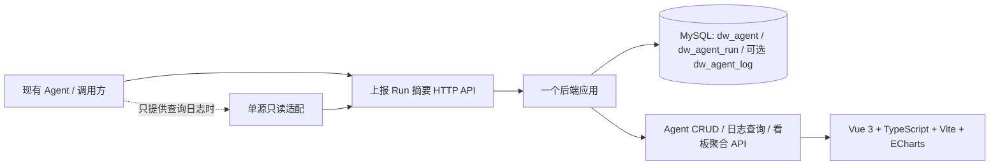

# 03｜MVP 技术架构：Agent 登记 + Run 日志 + 看板

> **已确认业务范围**：[17 极简 Agent 日志看板](17-agent-log-dashboard-mvp.md)。Vue 3 + TS + Vite 已确认；**Spring Boot/MySQL 和具体接口均是推荐实施选型，未作生产部署承诺**。原复杂业务 Task、Connector、对账方案退出 MVP。

## 1. 极简架构



**重点**：不改造现有 Agent 执行引擎，不做 Agent 编排、业务审批、领域系统状态整合；没有需要先建微服务、Kafka、Flink、Doris 或多租户通用管控平台的证据。

## 2. 推荐模块

| 模块 | 责任 | 要避免 |
| --- | --- | --- |
| `catalog` | Agent 登记、编辑、停用、来源 ID 唯一 | 复杂 Capability/Binding 和上岗审批 |
| `ingest` | 安全接收 Run 日志、幂等、校验、脱敏 | 请求失败反向阻断 Agent |
| `query` | Agent Run 分页、最近错误与采集时间 | 无限制传输敏感 Prompt |
| `dashboard` | Agent/Run 的聚合查询和趋势 | 将 Run 称为业务交付或虚构工时成本 |

Java 17/21 + Spring Boot 3 + MyBatis-Plus + MySQL 是候选实现。量级较小时可以由 MySQL 的复合索引和聚合查询完成看板；性能确有瓶颈后再增添每日汇总表。

## 3. 关联关系

```text
dw_agent
  1 ─── N dw_agent_run
                 1 ─── N dw_agent_log (可选)
```

- `dw_agent`: `id, platform, environment, external_agent_id, name, department_id, owner, description, enabled, created_at, updated_at`。
- `dw_agent_run`: `id, agent_id, source_run_id, status, started_at, finished_at, duration_ms, received_at, input_tokens?, output_tokens?, error_code?, error_message?`。
- `dw_agent_log`：按需存 Run 内**脱敏的短日志**；不一定首期建。
- 唯一约束：`dw_agent(platform, environment, external_agent_id)`（多账号空间的平台需加源命名空间）；`dw_agent_run(agent_id, source_run_id)`。
- 推荐索引：`dw_agent_run(agent_id, started_at)`, `dw_agent_run(status, finished_at)`；对日志查询必须分页和设置保留策略。

## 4. HTTP 接口（草案）

```text
GET   /api/v1/agents                    # 查询 Agent
POST  /api/v1/agents                    # 新增登记
GET   /api/v1/agents/{id}               # Agent 详情
PATCH /api/v1/agents/{id}               # 编辑/启停
POST  /api/v1/ingest/agent-runs         # 上报 Run 摘要；调用方身份认证
POST  /api/v1/ingest/agent-logs         # 可选分级日志
GET   /api/v1/agents/{id}/runs          # Run 分页/筛选
GET   /api/v1/dashboard/overview        # 总数、Run、成功率、平均耗时
GET   /api/v1/dashboard/trends          # 日维度 Run/失败/耗时
GET   /api/v1/dashboard/rankings        # Agent Run 排行
```

实际接口路径/字段由第一批源 Agent 日志 schema 再冻结。

## 5. 最小可靠性和安全性

1. **接收端鉴权**：服务到服务凭证；服务端限制它能代表哪一个或哪些 Agent 上报，不信任 JSON 中任意 `agent_id`。
2. **幂等**：同一源 Agent + Run ID 多次上报只对应一条 Run，允许 `RUNNING → SUCCEEDED / FAILED / CANCELLED` 终态更新，拒绝倒退状态。
3. **日志最小化**：不存原文 Prompt、上传文件和业务凭证；敏感信息在接入前/接入端脱敏，错误消息做截断与大小限制。
4. **读权限**：集团/部门授权查看所需范围，源 Agent 日志和异常不能在公共静态站点暴露；尽量复用现有身份体系。
5. **数据质量**：`enabled` 与最近实际日志时间分开；采集间断不自动断言 Agent 已宕机。页面展示最近收到时间。
6. **环境隔离**：TEST/PROD Run 不混算；DEMO 数据不写到正式业务表。
7. **后续可演进**：源平台不能主动上报时写针对性简单拉取任务即可，不必引入通用 Connector 管理后台。

## 6. 与原型的关系

原 HTML 文件继续作为 UI-F0 视觉事实基准，**不要覆盖**。UI-F1 仅把原有位置的“今日任务/当日成本/节省工时”等换成**Agent Run 指标**，场景页保留静态说明而不是新增业务审批和复杂工作流后台。详见 [17](17-agent-log-dashboard-mvp.md)。

## 7. 待接入源验证

尚不清楚第一批 Agent 在百炼、Dify、自研服务或其他平台运行，是否已有稳定 Run ID 和标准日志接口。接入前应拿到真实但脱敏的 Run 样本、状态定义、日志字段和鉴权能力；无需启动业务结果回执/财务基线的大型调研。
