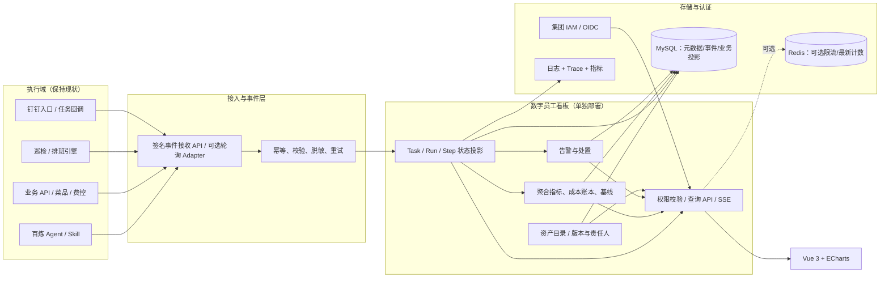

# 03｜技术架构与接入方案（讨论稿）

## 0. 决策背景与优先级

**已确认**：首期面向集团管理层，产品入口为运营驾驶舱。技术架构应先确保**业务结果真值、可追溯工时/成本、权限和可核对汇总**，而非首先建设秒级技术监控。具体技术栈仍待研发评估；权衡理由参见 [07 管理层指标架构](07-executive-data-architecture.md)。

## 1. 决策倾向：观测控制面，而非 Agent 运行时

原型的五类业务能力横跨 Agent+Skill、规则求解、业务 API 和监控聚合。以“统一迁移到某个 Agent 框架”为前置条件会导致改造周期与组织协调失控。

**推荐架构**：看板是业务数字员工的 **Control/Observability Plane**；Agent、钉钉与领域业务服务是 **Execution Plane**。数字员工执行成功由源业务系统最终回执判定，而不是模型输出文本。



**关键：事件采集链路必须与业务主链路解耦**。看板不可用时，业务处理不受影响；发送端异步重试或经现有消息队列缓冲。

## 2. 分层与建议实现

| 层次 | MVP 推荐 | 原因 / 后续演进 |
| --- | --- | --- |
| Web | Vue 3 + TS + Vite + ECharts | 原型已有 ECharts；容易做筛选、详情和分页 |
| API | Java 17/21 + Spring Boot 3 + MyBatis-Plus | 与常见企业后端体系一致；单体模块化足够起步 |
| IAM | 现有 OIDC 单点登录 + 业务数据范围授权 | 不自建账号体系，不使用仅前端隐藏菜单做权限 |
| Ingest | HTTP POST / signed Webhook，批量接入可补适配器 | 改动少；先证明数据可信，再考虑消息中间件 |
| 数据 | MySQL 8（员工、任务、执行尝试、事件、聚合、告警） | 支持审计与幂等事务；按业务需求做索引和分区/归档 |
| 文件 | 企业授权对象存储 | 工作流图文件/版本，与业务数据分离 |
| 刷新 | 管理层首页：快照查询 + 手动/3–5 分钟轮询（建议）；技术监控可用 SSE | 高精度实时流是 P1，不是高管驾驶舱的前置条件；必须鉴权与显示数据截至时间 |
| 分析 | MySQL 预聚合（日/员工/部门/场景）+ 数据快照元信息 | 必须保留源业务对账/回补路径；规模证实后引入 Doris 等 OLAP |
| 可观测 | OpenTelemetry 关联 + 现有日志告警 | 按 `trace_id` 对接已有链路监控 |

**暂不拆大量微服务**：按 `catalog / ingest / execution / metrics / alert / governance` 分模块，稳定后再按瓶颈拆。

## 3. 三条接入路径

1. **主动上报（优先）**：业务代码/Agent Gateway 在任务状态关键点发送结构化事件。最完整地拿到业务 ID、耗时、回执、审批状态。
2. **平台事件消费**：已有 Kafka/回调/业务域事件，增设 Adapter 转为规范事件。不要让看板直接订阅隐含业务逻辑的裸消息。
3. **定期拉取（降级）**：无法改造的旧系统，以服务账号只读、增量时间戳/游标同步状态。明确采集频率、延迟与漏数校验。

Agent 输出、LLM Token、工具调用是**技术指标**；真正的“调整成功/提单完成/报告送达”等应对接**业务结果事件**。

## 4. 一次任务的完整事件流（示例）

```text
钉钉发起菜品调整
  → 业务服务分配 source_task_id，建立或映射平台 task_id
  → TaskAccepted
  → RunStarted (attempt=1)
  → StepRecorded (LLM意图解析、参数校验、tool调用，均具 trace_id)
  → ApprovalRequested / WAITING_HUMAN （高风险时；用户审核在业务系统）
  → ApprovalResolved（由业务系统回调）
  → BusinessOutcomeConfirmed（源菜品系统生效/分发回执）
  → TaskSucceeded / TaskFailed
  → 异步聚合指标、更新告警与详情页
```

重试示例：`TaskAccepted` 只发一次；每次重试生成不同 `run_id` 与 `attempt_no`；最终业务任务只计一次。对于长时审批，不要把等待时间一概算成 Agent 运行延迟；同时记录端到端交付耗时与纯自动执行耗时。

## 5. 一致性和幂等

- 每个事件必须携带：`source_system + source_event_id` 唯一组合，重复上报只能生效一次。
- 业务身份：`source_system + source_task_id` 映射平台 `task_id`；不得仅凭描述文字/时间戳合并。
- 事件记录与投影变更**同库单事务**或以事务性 Outbox 实现；不同来源顺序乱序时按源版本/序列或合法状态转换执行。
- `occurred_at`（实际发生）与 `received_at`（平台接收）双时间；统计按业务发生时间，以来源时区/营业日规则为准。
- 收到重复“业务成功”事件不得重复计数或重复计费；允许更正事件，不悄悄覆盖历史。
- 看板向业务系统的“处置/重试”属于额外写入操作，需要审批、安全令牌与独立审计；MVP 只读或跳转。

## 6. 权限与治理

**身份**：集团 IAM/OIDC 登录，API 校验 access token，禁止仅信任前端传的 `department_id`。

**RBAC + 数据范围**：`DASHBOARD_ADMIN, GROUP_VIEWER, DEPT_OWNER, EMPLOYEE_OWNER, OPS, FINANCE_AUDITOR` 等角色；按实际组织树、员工责任范围与业务授权交叉检查。

**数据保密**：
- 事件只保留安全业务引用 ID，拒绝采集完整账单、身份证、银行账号、原始 Prompt 和未经脱敏的模型上下文。
- 报错、trace 与导出脱敏；文件访问时效签名 URL；保留策略按企业制度确定。
- webhook/API 接口 mTLS、签名/HMAC 或服务端 OAuth 客户端凭证、最小权限；签名含时间戳防重放。
- 接入密钥由安全配置/Secret Manager 保管，**不可提交 GitHub**。
- 操作日志至少有 `actor / action / object / before / after / reason / timestamp`；审批由源业务系统执行，平台留引用。
- 公共仓库只存契约样例和设计，不公开内网地址与实际审批阈值。

## 7. 监控与告警规则

推荐定义以下技术与业务告警：
- **接入异常**：某源系统最后上报时间超阈值、批量同步积压、事件去重失败率上升。
- **执行异常**：任务失败率、P95 耗时、超时积压、重试次数超限。
- **流程异常**：人工待办超 SLA、关键业务回执超时、审批回调丢失。
- **指标异常**：完成事件显著减少、成本突然升高、数据漏项、比对源系统总量差异超阈值。

告警去重键可用 `rule_id + employee_id + source + dimension`，避免同一故障刷屏。保留严重度、状态、处理人与工单 ID；静默需设置失效时间。

## 8. 上线与部署选项

- 内部应用；对接已有 K8s/Ingress、SSO、监控与日志平台。
- 分 DEV/TEST/PROD，接口契约版本化；前端 URL 与 API 来源按环境配置。
- 数据库做迁移脚本与增量归档；上线前压测任务列表、聚合查询、事件接入及断链重试。
- 首期无需覆盖所有门店实时细项。把高频门店设备时序数据留在原监控系统，看板只记录巡检任务摘要和异常状态，否则存储模型会失控。
- 数据量、请求量、保留期限、对象存储与集群约束由现场调研补充，以上为建议架构，不是已完成部署。
