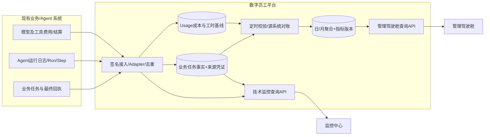

# 07｜管理层优先的技术取舍、汇总接口与数据验真

> **已确认**：产品受众首期“集团管理层优先”；首轮 UI 必须依照 [原始 HTML](../prototype/index.html) **1:1 还原布局与交互**。以下数据架构及时效目标仍为建议，可在 UI-F1 时接入；本文件的管理层查询/刷新取舍不能覆盖 UI-F0 视觉基准。详见 [08 UI 还原规范](08-ui-reproduction.md)。
>
> 以 [管理层页面设计](06-management-dashboard.md)、[总体技术架构](03-architecture.md)、[指标字典](04-metrics-and-contracts.md) 为前置。

## 1. 核心架构选择：经营指标先可靠，再谈实时感

原型靠浏览器每 6 秒模拟执行日志，是展示效果；管理层正式看板更需要**一段时间内可追溯、可核对、可解释的数字**，不必在每 6 秒滚动一次数字。

建议将数据分为两个链路：



**路径 A：经营事实**。源系统最终回执→幂等任务事实→基线/成本→对账→按日聚合→首页。这是 P0。
**路径 B：技术观测**。Run/Step/工具调用/Trace→错误排查与告警。这保留但**不应成为 P0 的开发阻塞项**。

若源系统暂时只能提供每日批量对账，首页也可先呈现“截至昨日已核验”；不能因此伪装成真正实时。今日增量若展示，须标注“暂估/尚未完成对账”。

## 2. 关键取舍表（“优先推荐”不等于已审批定案）

| 决策点 | 优先推荐（MVP） | 推迟的选项 | 依据 / 触发升级条件 |
| --- | --- | --- | --- |
| 前端页面 | **响应式内部 Web + ECharts**；从原型组件化 | 大屏炫技、3D 虚拟人、复杂动效 | 管理层需要阅读/比较/下钻，非纯屏保 |
| 后端组织 | **一个 Spring Boot 模块化服务**，分 catalog/ingest/metrics/report/alert | 从一开始拆多微服务 | 减少维护和链路成本，负载与独立团队边界出现后再拆 |
| 统计存储 | **MySQL 明细 + 日/月聚合表**；首页查聚合快照 | 一开始上 Doris/Flink/ES 全套 | 先核验任务规模与查询压力；明细量大/复杂实时分析出现后升级 OLAP |
| 事件输入 | **业务回执为真值；Webhook / Adapter / Kafka 根据现有系统选择** | 强行统一重构各 Agent 运行时 | 源业务有不同能力，优先降低改造成本 |
| 实时刷新 | **手动刷新 + 定时轻量刷新（建议 3–5 分钟）**，明显显示 as_of | SSE/WebSocket 高频推流 | 管理层不会因 5 秒新数字产生新决策；若运营日内看板需求明确再加 |
| 效能 | **有样本和签署的工时 + 成本凭证** | 首期直接展示未经验证的 ROI 排名 | 经营价值不能仅通过 Token 或平均工资推断 |
| 权限 | **集团 IAM/OIDC + 后端 ABAC/RBAC 数据范围** | 新建用户中心、仅前端过滤 | 数据含部门成本与财务口径，权限必须服务端落实 |
| 报表 | **同一聚合快照/指标字典导出**（可 P1） | 另造 Excel 手工汇总逻辑 | 防止“看板一套数、PPT 一套数” |
| 任务详情 | **业务回执 + 关键阶段 + 状态即可** | 一开始保存所有 Prompt/模型输出 | 降低数据安全、存储和接入负担 |

## 3. 聚合快照与回补

逻辑数据层次建议：
1. `dw_employee` + `dw_employee_verification`：目录、业务负责人确认、接入验证与生效时段。
2. `dw_task` + `dw_run` + `dw_event_inbox`：源业务任务唯一身份、运行尝试和审计事件。
3. `dw_metric_baseline` + `dw_usage`：工时基线版本、实际/估算成本。
4. `dw_metric_daily`：按**事件发生时业务归属快照**、场景、任务类型、日期及指标口径版本预聚合。
5. `dw_metric_snapshot`：管理层按筛选条件展示的结果快照元信息：`as_of, reconciled_through, source_coverage, metric_version, calc_status`。

**注意**：`dw_metric_daily` 是可重算的派生缓存，不能作为唯一事实源。T+1 源系统业务单据回补时，重算受影响日期，并生成可审计的刷新版本。

聚合维度不能随意重复：同一集团业务任务只分配**一个主归属部门**，跨部门合作可另建维度映射供说明，不能在集团汇总把同一任务重复累计。

## 4. 首页查询 API 的管理层版契约

推荐对原 `GET /api/v1/overview` 增加语义清晰的响应，而不是前端自己从执行流水循环求和。

示例（示意结构，全部数值为 `null`，绝非真实集团数据）：

```http
GET /api/v1/overview?from=2026-10-01&to=2026-10-10&department_id=ALL
```

```json
{
  "period": {
    "start_inclusive": "2026-10-01",
    "end_exclusive": "2026-10-10",
    "timezone": "Asia/Shanghai",
    "period_type": "MONTH_TO_DATE"
  },
  "filters": { "department_id": "ALL", "scenario_id": "ALL" },
  "as_of": "2026-10-09T17:00:00+08:00",
  "reconciled_through": null,
  "metric_version": "proposal-v0.2",
  "collection": {
    "expected_scenarios": null,
    "verified_connected_scenarios": null,
    "task_reconciliation": "NOT_AVAILABLE",
    "freshness": "UNKNOWN"
  },
  "kpis": {
    "verified_active_employees": {
      "value": null, "unit": "employee", "quality": "UNAVAILABLE",
      "reason": "Awaiting catalog verification"
    },
    "completed_business_tasks": {
      "value": null, "unit": "task", "quality": "UNAVAILABLE",
      "reason": "Awaiting business outcome source"
    },
    "verified_hours_released": {
      "value": null, "unit": "hour", "quality": "UNAVAILABLE",
      "reason": "Awaiting approved manual baseline"
    },
    "operating_cost_cny": {
      "value": null, "unit": "CNY", "quality": "UNAVAILABLE",
      "reason": "Awaiting source and allocation policy"
    },
    "business_success_rate": {
      "value": null, "unit": "ratio", "numerator": null,
      "denominator": null, "quality": "UNAVAILABLE"
    }
  }
}
```

状态定义：
- `VERIFIED`：该**指标本身**已通过业务凭证、口径和必要的签认验证；
- `ESTIMATED`：可解释估算，但未经完整确认；
- `UNAVAILABLE`：尚无计算条件、来源未接入，或不可展示；
- `STALE`：预期有数据但已超过新鲜度门槛，不允许继续渲染“在线”。
- `DEMO`：仅独立演示模式，生产报表永不混算。

注意 **事件来源身份已验证 ≠ 指标已经财务核准**；事件原始 `data_quality` 与首页的 `kpi.quality` 是两个不同概念，后者需要按数据治理规则推导。

`as_of` 表示响应快照的时间；`reconciled_through` 表示最后与源系统核对完成的日期/时间，不可以用服务器当前时间替代。

## 5. 关键一致性准则

- **存量 vs 流量**：上线员工数按查询结束时点快照；任务、工时、成本按时间区间累计，不能把上线数月度相加。
- **完整周期 vs 本月至今**：本月至今只能与上月同等已过天数对比（必要时按营业日对齐）。
- **跨场景口径**：任务总数是工作量规模，不代表“1 份巡检=1 份报销=1 张排班表”价值相等。
- **工时释放 vs 现金节省**：人工时间的机会成本不自动构成真实费用减少；ROI 需要可核验经济收益和财务批准。
- **计数与账本**：一次任务包含多个 Run/Step；成本 usage ID 只能记一次；同一任务跨部门仅计一个主业务归属。
- **今日数的真实性**：今天尚未结算的费率展示估算；已回补或更正显示指标版本变更记录。
- **待核验 vs 0**：没有源业务事件绝非“执行 0”；必须先看接入状态和预期频率。
- **人审不是失败**：人审流程可合规且高价值，另列自动化程度指标，不能仅凭人工介入推导低效。
- **权限和导出**：API 在 SQL 查询层校验组织数据范围，不能把全集团指标下发给浏览器再做隐藏。

## 6. P0 / P1 后端交付与依赖

### P0 必须实现（面向经营驾驶舱）

- OIDC 登录、集团/部门数据范围、员工登记与核验审批字段；
- 一条完整的业务任务事实链：来源 ID、接收、最终结果、失败和回补；
- 首页数据服务：员工数、任务完成、质量指标 + 空状态/数据新鲜度；
- 两个试点场景接入回执与数据对账，员工/场景下钻；
- 可配置工时基线表、成本基础账本/占位状态；**没有验证时不可输出确认收益**；
- 重大异常汇总入口、最小运行监控与审计。

### P1 根据证据与需要加入

- 全量 Step/Trace 索引、复杂告警编排、技术级秒级推送；
- 财务认可的全成本分摊、财务核验价值与 ROI；
- 完整报表导出/定时推送、管理大屏轮播；
- Doris/OLAP 以及高频实时分析优化；
- 工作流编排、自动重试/控制业务系统等仍需另行立项和安全审批。

## 7. 架构验收样例

1. 原系统在多个 Run 重试后返回唯一业务成功：完成任务数增加 1，成本按 usage 去重。
2. 源系统停更 2 小时：指标为 STALE/上次有效时间，而不是显示运行中且继续涨。
3. 工时基线没有批准：`verified_hours_released.value=null`、`quality=UNAVAILABLE`，不冒出计算值。
4. 本月与上月比较：查询口径一致，前端不能把“本月至今”对“整个上月”展示增长率。
5. 部门员工跨部门调配：旧日聚合按历史所属，集团汇总不重复。
6. 报表导出与页面同过滤条件、同指标快照版本，且遵守权限。
7. 采集回补时原始事件保留，可重放日聚合，并能解释被修正的数值。
