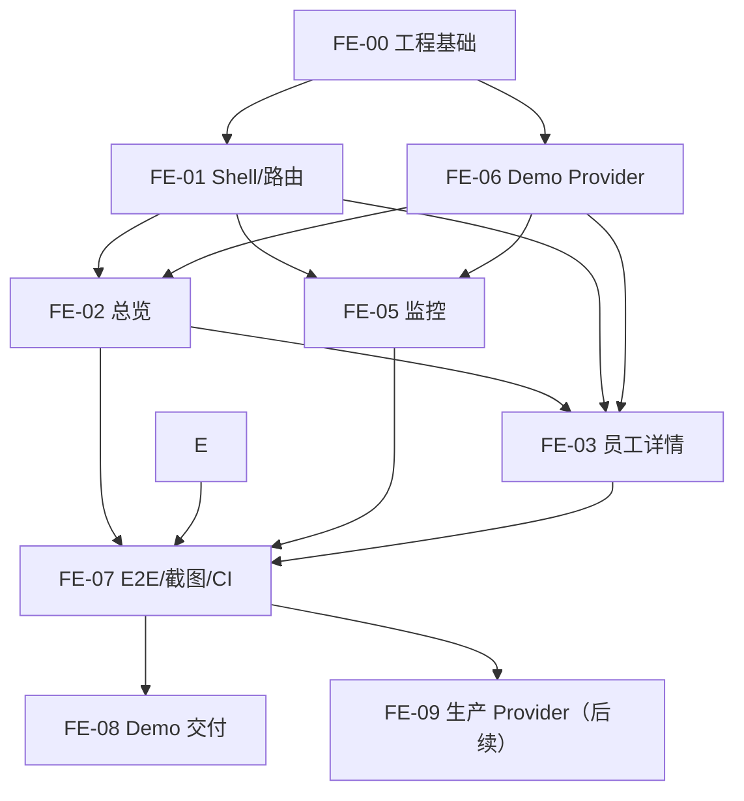

> **A10 范围删减（2026-10-10）**：用户取消场景演示。新 Vue UI-F0 与 UI-F1 **不构建** `ScenarioDemoPage.vue`、`ScenarioFlow.vue`、`scenarios.ts`、场景导航及 Agent 关联字段，页面为 p0/p11/p4 三页。**FE-04 / Issue #7 已取消，不属于交付依赖**；原型 HTML 保持只读。此裁决覆盖下文所有旧“4 页/5 场景/FE-04”要求。

# 11｜Vue 工程目录、开发任务与实施顺序

> **确认项：Vue 3 + TypeScript + Vite；严格按原始 HTML 1:1 组件化还原。**
>
> **本文状态**：研发执行清单和建议目录已制定，**尚未创建 frontend/ 工程，也未执行构建、测试或部署**。后端实现、生产 API、公开 Pages 发布仍不属于已确认范围。
>
> 关联：[技术决策 ADR](10-frontend-adr.md) · [页面交互](12-frontend-interactions.md) · [测试验收](13-ui-acceptance.md) · [原始原型](../prototype/index.html)。

## 1. 目标与分阶段边界

**UI-F0（本轮计划）**：构建可独立运行的 Vue Demo，视觉/交互忠实复刻附件；员工为隔离演示数据、不接生产。验收为**三页（总览/详情/监控）、无场景演示按钮及 p7 路由**、其余现有图表、导航、上传预览、告警演示及多视口截图。

**UI-F1（下一阶段，已收缩）**：同一组件通过正式 Provider 接入**登记 Agent + Agent Run 日志 + 技术指标**，不接业务回执、成本工时、告警写入。参见 [17 最新 MVP](17-agent-log-dashboard-mvp.md)。

**UI-F2（需要单独确认）**：管理层 KPI 重排、月报、部门贡献布局、ROI 等优化，不影响 UI-F0 已确认的页面基准。

## 2. 建议的仓库目录树（目标结构，不代表已经建成）

```text
digital-workforce-dashboard/
├── AGENTS.md
├── README.md
├── prototype/
│   ├── index.html                        # 唯一原始 1:1 参考，禁止修改
│   └── README.md
├── docs/
│   ├── 01...09...md                      # 产品、架构、原型审阅
│   ├── 10-frontend-adr.md                # 已确认技术栈
│   ├── 11-frontend-backlog.md            # 当前任务拆解
│   ├── 12-frontend-interactions.md       # 页面、路由、动作
│   └── 13-ui-acceptance.md               # 验收矩阵与 CI
├── frontend/                              # FE-00 开始创建
│   ├── package.json
│   ├── <lockfile>                         # 团队只选一种包管理器；提交锁文件
│   ├── index.html                         # Vite 应用入口，不覆盖 prototype
│   ├── vite.config.ts
│   ├── tsconfig.json
│   ├── eslint.config.js
│   ├── src/
│   │   ├── main.ts
│   │   ├── App.vue
│   │   ├── router/
│   │   │   └── index.ts
│   │   ├── layouts/
│   │   │   └── DashboardShell.vue
│   │   ├── pages/
│   │   │   ├── OverviewPage.vue          # p0
│   │   │   ├── EmployeeDetailPage.vue    # p11
│   │   │   └── MonitoringPage.vue        # p4
│   │   ├── components/
│   │   │   ├── KpiCard.vue
│   │   │   ├── EmployeeCard.vue
│   │   │   ├── EmployeeGroup.vue
│   │   │   ├── SectionPanel.vue
│   │   │   ├── EChartPanel.vue
│   │   │   ├── ExecutionFeed.vue
│   │   │   ├── AlertItem.vue
│   │   │   ├── WorkflowUploader.vue
│   │   │   └── DemoBadge.vue
│   │   ├── charts/
│   │   │   ├── overviewOptions.ts         # 拷贝原型 3 张图的 ECharts option
│   │   │   └── employeeOptions.ts         # 详情 3 张图
│   │   ├── assets/
│   │   ├── styles/
│   │   │   ├── tokens.css                 # 原 CSS 颜色/字体/圆角/尺寸
│   │   │   └── prototype.css              # 原布局规则，不擅自改版
│   │   ├── domain/
│   │   │   ├── employee.ts
│   │   │   ├── dashboard.ts
│   │   │   ├── metrics.ts
│   │   │   └── alert.ts
│   │   ├── providers/
│   │   │   ├── DashboardProvider.ts
│   │   │   ├── DemoProvider.ts
│   │   │   ├── DemoTicker.ts
│   │   │   └── ApiProvider.ts             # UI-F1 时接入
│   │   ├── demo/
│   │   │   ├── employees.ts
│   │   │   ├── performance.ts
│   │   │   └── alerts.ts
│   │   ├── composables/
│   │   │   ├── useEChart.ts               # mounted/resize/dispose
│   │   │   └── useDashboardData.ts
│   │   └── services/
│   │       └── dashboardApi.ts            # UI-F1 时启用
│   ├── tests/
│   │   ├── unit/
│   │   ├── e2e/
│   │   └── visual/
│   │       ├── baselines/
│   │       └── reports/                   # 自动生成，勿提交真实业务数据
│   ├── playwright.config.ts
│   ├── vitest.config.ts
│   └── README.md
└── .github/
    └── workflows/
        └── frontend-ci.yml                # FE-07 时创建
```

`<lockfile>` 指选用的 npm/pnpm/yarn 锁文件之一，路径是占位，不是字面文件名。对实际组件划分可为避免抽象过度做小幅调整，只要页面对照/契约不变即可。

## 3. 职责分层（限制耦合）

| 层 | 允许做什么 | 不允许做什么 |
| --- | --- | --- |
| `pages/` | 组织页面结构、数据订阅、加载/空状态 | 硬编码远程 URL、鉴权细节或演示随机数 |
| `components/` | 通过 props/events 渲染 KPI、图表、表格、动作 | 直接调用真实业务写操作；全局 DOM 修改 |
| `charts/` | ECharts option 转换、单位和 tooltip 模板 | 偷改运营统计公式 |
| `domain/` | TypeScript 领域模型、质量状态、ID 与筛选条件 | 引用 Vue DOM 对象 |
| `providers/` | 标准查询契约与 Demo/真实数据实现 | 在生产缺数据时从 Demo 填默认数字 |
| `demo/` | 原型固定样本、演示流程、可重复随机与时钟 | 生产成功判定 |
| `services/` | UI-F1 HTTP/OIDC 适配、请求/响应转换 | 在浏览器保存长期凭据、绕过权限 |
| `styles/` | 原 CSS token、布局、响应式规则 | 为“优化”而擅改首屏布局 |

跨层依赖建议为 `Page → Provider interface → DemoProvider / ApiProvider`；图表由 Page 转换为纯 `option` props，不把 `echarts.init()` 分散到业务事件回调中。

## 4. GitHub 开发任务清单（已创建）

| 编号 | GitHub | 阶段/优先级 | 交付内容 | 前置依赖 | 粗粒度大小（非工期） |
| --- | --- | --- | --- | --- | --- |
| FE-00 | [#2](https://github.com/jackson-heylion/digital-workforce-dashboard/issues/2) | UI-F0 / P0 | Vite 工程、类型检查、包锁定、原型保护 | 无 | S |
| FE-01 | [#3](https://github.com/jackson-heylion/digital-workforce-dashboard/issues/3) | UI-F0 / P0 | 视觉 token、DashboardShell、**3 页路由**与 nav 高亮（不含 p7） | FE-00 | M |
| FE-06 | [#4](https://github.com/jackson-heylion/digital-workforce-dashboard/issues/4) | UI-F0 / P0 | 9 员工演示资料、Provider、可控模拟事件；**不含五场景或绑定** | FE-00 | M |
| FE-02 | [#5](https://github.com/jackson-heylion/digital-workforce-dashboard/issues/5) | UI-F0 / P0 | 原型总览、3 图、分部门卡片与实时动态 | FE-01、FE-06 | L |
| FE-03 | [#6](https://github.com/jackson-heylion/digital-workforce-dashboard/issues/6) | UI-F0 / P0 | 员工详情、3 图、工作流上传预览 | FE-01、FE-06、FE-02 | L |
| ~~FE-04~~ | [#7](https://github.com/jackson-heylion/digital-workforce-dashboard/issues/7) | **已取消** | ~~5 个场景及所有锚点跳转~~；用户决定不实施 | — | — |
| FE-05 | [#8](https://github.com/jackson-heylion/digital-workforce-dashboard/issues/8) | UI-F0 / P0 | 监控、告警演示、执行流水 | FE-01、FE-06 | M |
| FE-07 | [#9](https://github.com/jackson-heylion/digital-workforce-dashboard/issues/9) | UI-F0 / P0 | Playwright/Vitest、跨视口截图、CI 质量门禁 | FE-01、FE-02、FE-03、FE-05、FE-06（FE-04 取消） | L |
| FE-08 | [#10](https://github.com/jackson-heylion/digital-workforce-dashboard/issues/10) | UI-F0 / P0 | Demo 构建预览、README、差异说明、验收材料 | FE-07 | S |
| FE-09 | [#11](https://github.com/jackson-heylion/digital-workforce-dashboard/issues/11) | UI-F1 / P1 | **正式 Agent 目录/Run 日志/技术指标 Provider** | FE-07、BE-A/BE-B/BE-C | M |

**排序说明**：FE-06 是编号较靠后但可在 FE-01 期间并行执行的**基础数据任务**；不要误以为需要做完 FE-05 才能开始它。FE-02/03/05 视开发资源可并行（FE-04 已取消）。最关键的完成顺序为：



## 4.1 极简后端配套任务（2026-10-10 新增）

- [BE-A #12](https://github.com/jackson-heylion/digital-workforce-dashboard/issues/12)：Agent 登记 CRUD 与基本权限。
- [BE-B #13](https://github.com/jackson-heylion/digital-workforce-dashboard/issues/13)：单 Agent Run 日志鉴权上报、幂等与分页查询。
- [BE-C #14](https://github.com/jackson-heylion/digital-workforce-dashboard/issues/14)：Run 技术指标聚合、趋势和排行。

它们建议在一个轻量后端服务实现。**不建复杂 Connector、业务 Task/Outcome 账本和财务工时对账**。

## 5. 里程碑定义（建议按可交付物，而非不确定日历）

| 里程碑 | 结束条件 | 涉及 Issue |
| --- | --- | --- |
| M0 工程可运行 | Vue 项目可安装/启动/构建；基线文件未变 | #2 |
| M1 公共框架/数据可用 | 公共样式、路由、Demo 数据服务可演示 | #3、#4 |
| M2 三页功能复刻 | 总览、详情、监控交互齐全；无场景演示页与入口 | #5、#6、#8（#7 已取消） |
| M3 UI-F0 可验收 | 所有 viewport 截图、交互测试与质量门禁通过；Demo 可独立访问 | #9、#10 |
| M4 UI-F1 正式数据 | Agent CRUD/Run 日志采集和看板查询贯通，真实 Run 统计、技术成功率和平均耗时与明细一致；Demo 隔离 | #11～#14 |

## 6. 建议每个 PR 的完成定义

- PR 描述提供原型对应页/元素、代码路径、截图（同视口）与交互录像/步骤；
- 单一 PR 尽量聚焦一个 FE Issue；视觉变更需有原型对照或批准的差异说明；
- `prototype/index.html` Blob 必须保持原始值；
- `npm run build` 等具体脚本由 FE-00 确认和提交，不能在未有工程时声明“CI 已绿”；
- Vue 页面功能需满足 [12 交互契约](12-frontend-interactions.md)、[13 质量验收](13-ui-acceptance.md)；
- 已知缺口写明并发 follow-up Issue，不能把“只有静态页面”标为交互完成。

## 7. 尚未确认、不能偷换成已批准

- 生产后端选型、第一批 Agent 来源、Run ID/状态/时间戳字段与实际日志 API 可访问性；**不再以业务回执/工时 ROI 作为 MVP 条件**；
- 是否允许公开 GitHub Pages / 采用内部预览；不批准则暂在本地/授权环境预览；
- 管理驾驶舱四张新 KPI 的页面改版（原型 UI-F0 仍维持现有四卡）；
- 是否新增部门独立页、筛选器、报告导出、复杂告警管理等非原型页面；
- 生产运行的 SLO、人员安排和工期，须结合实际资源再估算。
