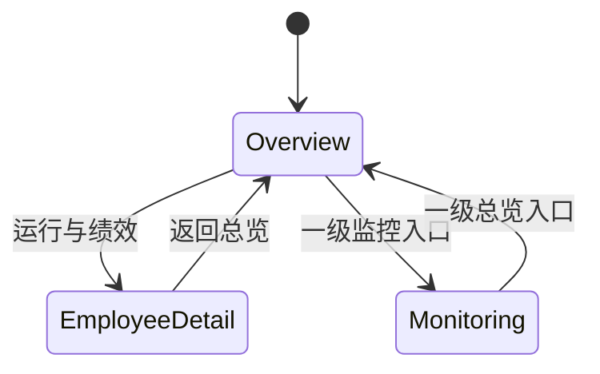

> **A10 用户已取消场景演示（2026-10-10）**：原型 HTML 原样保留；**新 Vue Demo 与正式模式**均不包含 `p7` 页面、`ScenarioDemoPage.vue`、`sc-1..5` 导航、员工卡/详情场景演示入口和 Agent 场景绑定。下文旧原型相关说明仅供历史参照，不作实现要求。

> **最新 MVP 覆盖说明（2026-10-10）**：本文件中 UI-F0 的原型交互还原继续有效。**UI-F1 正式版仅登记 Agent、采集 Run 日志、展示技术看板**；正式页面不实现业务任务/源回执、持久化工作流上传、真实告警处理/忽略和节省工时/财务成本。详见 [17 最新范围](17-agent-log-dashboard-mvp.md)。

# 12｜Vue 1:1 复刻：页面、路由与交互契约

> **性质：实施规范**。已确定 Vue 3 + TS + Vite 和“原型 1:1 还原”；页面字段、内容、样式与已实现的交互以 [原始 HTML](../prototype/index.html) 为事实基准。**下文独立 URL、浏览器前进后退、自动化测试结构是推荐增强，并非原型自带功能。**

## 1. 页面与 URL 对照

| 原型标识 | 页面组件（建议） | 推荐 URL | 一级导航高亮 | 核心内容 |
| --- | --- | --- | --- | --- |
| `p0` | `OverviewPage.vue` | `/` | 总览 | Banner、4 KPI、实时执行动态、按部门员工卡、工时/成本/排行图 |
| `p11` | `EmployeeDetailPage.vue` | `/employees/:employeeId` | 总览 | 员工信息、4 KPI、3 图、单文件工作流预览、最新执行日志 |
| `p4` | `MonitoringPage.vue` | `/monitoring` | 监控中心 | 4 KPI、告警列表、执行流水 |

以上是**逻辑路由路径**：内部正式部署可配置 History + 服务器 fallback；纯静态预览可选 Hash History；不要在同一个部署环境动态混用模式。

**新 Vue 无场景 ID 路由**；员工使用独立 `employeeId`，不能用员工昵称作唯一 ID（原型有同昵称）。

## 2. 通用 Shell

| 元素 | 原型行为 | Vue 实现注意 |
| --- | --- | --- |
| `.topbar` | 蓝色渐变品牌栏，企业标签，含 `#clock` 的系统状态文本 | 严格保留样式和结构；`#clock` 的实际更新行为以原型核验为准，不把显示时钟当心跳证据 |
| `#nav` | 2 个一级按钮；`p11` 高亮 `p0`；**不存在 `p7`** | 路由元信息 `activeNav`；不要增加第三个一级导航 |
| `main` | 最大宽 1280px、padding 与原型一致 | 搬运已有 CSS 变量、间距和 640px 断点 |
| footer | MVP v6 说明 | UI-F0 文案完全一致；正式环境的原型身份说明需单独审核 |
| Toast | 原型页面浮层提示 | 采用可复用组件；保留交互反馈，不引入新的大模态框覆盖页面 |

## 3. 总览 `p0`

- 页面初次加载展示原型顶部 Banner 和**原有四卡顺序**（数字员工总数、当日执行任务、当日成本、自动化成功率）。
- “实时执行动态”在 UI-F0 继续处于原位置；Demo 中动态追加条目、限制记录数，正式模式只能消费真实事件。
- 员工分组顺序按源码：信息中心 → 财务中心 → 采购中心 → 内审部 → 运营中心；示例数据 9 条。每组标题/统计数量和员工卡的名称、身份、负责人、来源、版本、执行/成功率/工时保持原样。
- “运行与绩效”对每名员工均可点开；**所有卡片均无「场景演示」按钮**。
- 三张图表：`c-hours`、`c-cost`、`c-top`，照原型 ECharts 的类型、轴、单位、颜色、标签、tooltip、顺序和配置还原。Demo 的 `genTrend` 和硬编码数据属于演示逻辑。
- 原 HTML 中 `renderEmps()` 被连续调用两次，但最终 DOM 无重复：Vue 只需保证**最终页面一致**，不重复发请求或保留非必要的重复渲染调用。

## 4. 员工详情 `p11`

1. 点击卡片“运行与绩效”→ 展示选中员工名称/部门/版本/四个 KPI→ 加载 3 图 `c-detail-trend`、`c-detail-hours`、`c-detail-cost`→ 显示工作流上传与最近日志。
2. 从详情点击“返回总览”→ 回 `p0`；**建议**恢复前一滚动位置（原型直接到页首，需在 UI-F0 截图验收明确是否沿用页首行为；默认按原型执行）。
3. **不生成 `btn-go-scene`**，也不在详情页提供场景演示跳转。
4. 切换详情对象时图表不能显示上一员工数据；离开页面时 ECharts 实例正确 `dispose`，再次进入重新挂载或显式 `resize`。
5. 文件支持原型 `accept="image/*,.pdf,application/pdf"`，点击/拖拽、图片/PDF 本地预览、重新上传替换、移除、在新标签打开；前端预览保留原文件名及大小信息。每次只展示最新文件。
6. UI-F0 文件不会保存到服务器：不得出现“已上传平台”的正式语义；UI-F1 才配置持久化与权限、安全校验。

## 5. 五场景 `p7`（用户已取消）

新 Vue 与正式版本**不开发、不注册路由、不生成导航及跳转**。原型源码仍保留其静态五场景，作为历史参考。

## 6. 监控中心 `p4`

- 点击二级导航“监控中心”呈现四张监控统计卡、告警列表和最近执行流水；原型使用静态/动态示例。
- Demo 告警的“处理/忽略”使当前项变为已完成样式并移除动作，出现带 **【演示】** 标识的 Toast；演示操作不产生真实业务系统写入。
- UI-F1 正式模式必须使用真实告警 ID、权限、审计和后端确认；**请求失败则保留/回滚告警的待处理状态并提示原因**，绝不直接宣布成功。
- 流水保留原型列：时间、员工、任务、结果、耗时；长内容遵循现有横向滚动样式。

## 7. 演示事件与生产事件的边界

### Demo Provider（UI-F0）

- 原型模拟源 `evPool`、`perfData`、`genTrend`、`pushFeed` 移到独立模块。
- 首次进入时可显示一条模拟事件；原型每 6 秒追加事件并递增相关演示数值，正式模式不能使用这段自动递增逻辑。
- 推荐增加**可测试的模拟时钟与固定随机种子**，以便 Playwright 冻结快照；不改变普通演示时的可见效果。
- 定时器在 provider 生命周期统一管理，启动不能因页面重挂载重复订阅；暂停和销毁时清理。
- 所有演示页有显式“演示数据”环境标签；生产构建不得注入示例人的业务状态作为在线事实。

### Production Provider（UI-F1）

- API 响应使用 `Metric<T>` 携带 `quality, asOf, reason`；页面区分真实 0、无数据、延迟、估算和已核验。
- 业务任务是最小统计单位；运行尝试/LLM 调用不可充当工作量，业务成功有源系统结果证据。
- 任务/告警/工作流操作均由服务端做权限校验；数据范围由 JWT + 后端授权判断，而非仅前端隐藏。

## 8. 页面状态机（推荐）

后续路由直接访问员工详情时，如果员工不存在→“未找到”；无访问授权→“无权访问”；API 错误→“加载失败”，不要把异常替换为第一名员工卡或默认成功。

## 9. 可核对的交互验收用例 ID

| ID | 操作 | 预期结果 |
| --- | --- | --- |
| NAV-01 | 从总览切监控再切回 | 页面显示正确且只有一个一级导航处于高亮 |
| NAV-02 | 进入员工详情 | 一级“总览”高亮，展示与员工卡匹配的身份/绩效 |
| NAV-03 | 检查员工卡与详情页 | **不存在**场景演示入口、`sc-N` 跳转或 `/scenarios` 导航 |
| NAV-04 | 直接访问旧 `/scenarios` 路径 | 不加载场景演示页，按统一 404/安全回退处理（具体行为待前端路由规则确认） |
| EMP-01 | 遍历 9 张员工卡点击详情 | 正确关联数据；中文昵称重名不串数据 |
| CHART-01 | 首次进详情、切员工、调整浏览器宽度 | ECharts 显示完整、尺寸更新、无重复实例 |
| FILE-01 | 上传图片、再上传 PDF、预览、移除 | 最新单文件展示且资源 URL 已回收 |
| ALERT-01 | 在 Demo 中“处理/忽略” | 已处理样式 + 演示 Toast，其他告警不受影响 |
| FEED-01 | 演示动态运行、切换页面若干次 | 更新频率不加倍，不出现多个相同 Timer |
| DATA-01 | 生产无指标/事件源断连 | “未接入/待核验/数据延迟”而非伪造正数 |

与 [13 测试与验收](13-ui-acceptance.md) 的截图/CI 质量门禁配合执行。
