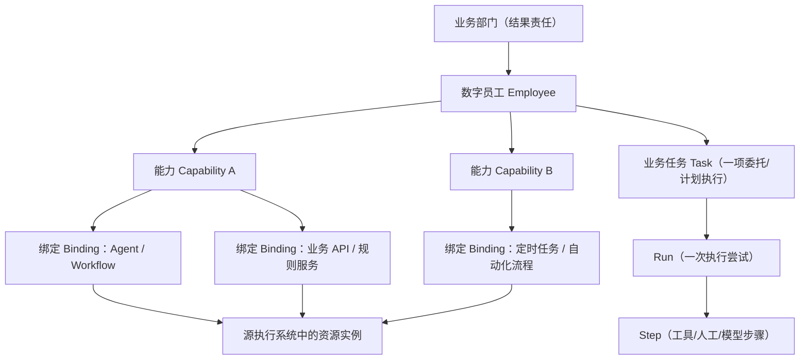

# 14｜数字员工管理中心：资产模型、生命周期与权限（讨论稿）

> **本文件为方案建议，不是项目发起人已确认的数字员工管理规则。** 已确认的只有：集团管理层优先、基于原始 HTML 1:1 复刻、前端 Vue 3 + TypeScript + Vite。管理后台的具体字段、审核要求与 UI 入口均待讨论。
>
> 原型依据：[prototype/index.html](../prototype/index.html) 中“按部门一览”9 个示例员工、5 个场景、“运行与绩效”详情及本地工作流上传。原型显示的真实在用/运行中/审批已定稿均属于原型声明，不能直接导入为生产真值。相邻文档：[PRD](02-product-prd.md)、[指标契约](04-metrics-and-contracts.md)、[数据接入讨论](15-data-integration.md)。

## 1. “数字员工”的定义与边界

**推荐定义**：数字员工是由业务部门指定职责与 Owner、可持续提供一项或一组明确业务能力、可计量交付和质量的**业务数字资产**，不等价于 LLM 模型、单个 Agent/Skill、账号、容器、副本或 API。

逻辑关系：



关系建议：
- 一个 Employee 属于一个**主要业务责任部门**，可有一个或多个使用部门；可区分技术建设部门。组织归属按历史生效日期留档。
- 一个 Employee 可以配置多个 Capability；一个 Capability 对应一种有业务计量单位的 `task_type`，定义结果凭证及是否需要人工审核。
- 多个 Capability 可复用同一技术资产，同一资产也可关联多个 Employee；必须通过关联关系和成本分摊规则**防止重复算业务任务、重复记成本**。
- Employee 是长期稳定 ID；源平台 Agent/workflow ID 只是外部绑定，不得作为 employee 主键。原型里“小营”用于多个不同员工，不能用昵称做外键。
- MVP 以“业务职责/服务单元”划分员工。如果一个 Agent 承担两个无关部门的多类任务，是否划成两名员工要由业务 Owner 共同确认，**不能自动按 Agent 数量拆分**。
- Agent/脚本/规则引擎即使不含 LLM，只要业务方认可其作为数字员工的交付服务，也可纳入；是否对外称“AI 数字员工”另由产品文案界定。

## 2. 从登记到退役的完整管理闭环

### 2.1 生命周期（业务管理状态）

| 状态 | 中文 | 进入条件（建议） | 是否计入“已核验上线” |
| --- | --- | --- | --- |
| `CANDIDATE` | 规划中 | 业务需求与负责人已登记 | 否 |
| `INTEGRATING` | 接入/验证中 | 能力与执行系统绑定，开始采集测试 | 否 |
| `ACTIVE` | 已上岗 | 业务 Owner 验收、已指定责任人、接入核验通过、真实完成事件可追溯 | 满足运行/核验附加条件时是 |
| `PAUSED` | 暂停服务 | 业务或安全负责人批准暂停 | 否（历史成果保留） |
| `RETIRED` | 退役 | 正式停止业务职责、保留审计与历史 | 否 |

关键规则：
1. **创建 ≠ 上岗；Agent 平台显示在线 ≠ 已上岗；近期有 Token 调用 ≠ 业务完成。**
2. 生产上岗前要校验必填字段、业务能力口径、责任归属、接入回执、权限/风险控制和核验凭证。
3. PAUSED/RETIRED 不删除原始任务和成本流水；历史报表按事件发生时的归属与身份快照。
4. 重新上岗或切换外部绑定需记录配置版本与审核人；高风险业务任务应由源业务平台控制是否可执行，不可因看板状态变化绕过其安全保护。
5. 健康检查只能反映接入链路，并不自动证明 Employee 处于 ACTIVE。

### 2.2 独立状态轴

- **业务生命周期**：`CANDIDATE / INTEGRATING / ACTIVE / PAUSED / RETIRED`；
- **接入状态**：`NOT_CONNECTED / VERIFYING / CONNECTED / STALE / ERROR`；
- **数据可信度**：`DEMO / ESTIMATED / VERIFIED / UNAVAILABLE`，其中成本/工时需要额外财务/业务核验；
- **业务运行健康**：按最近一段时间任务结果和错误/SLA 判断，可以 `HEALTHY / DEGRADED / INCIDENT / UNKNOWN`，**不能拿 0 条告警推导为 HEALTHY**。

在管理层员工卡上推荐展示：**“已上岗 · 数据已核验 / 数据延迟”**这样的组合标签；管理后台才展示完整四轴。

## 3. 后台管理信息架构（建议）

尽量不破坏原型的“总览 + 监控中心”两个一级导航：**首轮 UI-F0 完全照原型复刻**；UI-F1 新能力建议通过详情页中的“管理/配置”子入口或经授权的独立后台 URL 进入，不新增第三个管理层一级导航。入口方式待用户确认。

```text
原型总览 → 数字员工卡 → 运行与绩效详情（原样保留）
                                  ├─ 基本资料 / 业务职责
                                  ├─ 能力及任务定义（待讨论）
                                  ├─ 数据源与执行资源绑定（待讨论）
                                  ├─ 上岗核验与状态记录（待讨论）
                                  └─ 审计/配置变更（待讨论）
独立管理入口（仅管理员/业务 Owner 可见，待确认）
  ├─ 数字员工目录：新增、筛选、查看、编辑、停用
  ├─ 数据接入管理：适配器与映射、最近同步、对账
  ├─ 上岗审核：审核与签认凭证
  └─ 口径治理：Task 定义、工时基线、成本分摊版本
```

### 3.1 新建/编辑数字员工表单（P0 建议）

| 分组 | 字段 | 必填条件/说明 |
| --- | --- | --- |
| 唯一标识 | `employee_code`、`employee_id` | 系统分配稳定 ID + 企业可读业务编码；唯一，不通过昵称匹配 |
| 展示 | `display_name`、简介、图标/头像、标签 | 必填名称；头像演示可使用原型单字图标 |
| 业务归属 | `business_department_id`、`business_owner_id` | 主要责任部门和业务 Owner 必填 |
| 技术归属 | `tech_department_id`、`tech_owner_id` | 负责集成和故障响应；集团内部组织编码来源 IAM/HR |
| 能力定义 | `capability_id`、`task_type`、计量单位 | 不同业务任务粒度不能简单混为每次执行 |
| 执行信息 | 运行平台类型、外部资源 ID、环境、配置版本 | 通过关联绑定配置，而非直接把凭据写进 Employee |
| 风险 | 涉及外部写操作/高敏数据、原业务审核系统地址引用 | 不在看板直接执行高风险审批 |
| 上岗 | 计划/核验时间、验收证明引用、审核记录 | 上岗前强制业务/技术双角色核验（审批链长度待确认） |
| 效能 | 工时人工基线版本、成本分摊口径版本 | 未核验可缺省并标状态；不能伪造确值 |

表单建议默认小步：**基础信息 → 能力定义 → 系统绑定 → 校验/上岗**。不是让集团高管填写；分角色授权。

### 3.2 五个管理操作（首期建议）

1. **新建草稿**：创建 CANDIDATE，未联通也允许展示为“规划中”；
2. **配置/调整能力**：改变任务类型、Owner、源资源绑定时版本化，保留变更历史；
3. **测试连接**：校验源平台身份、权限、外部资源是否存在，必要时只读采样；
4. **申请上岗/审核**：业务 Owner 校验业务产出、技术 Owner 校验回执链路，再置 ACTIVE；
5. **暂停/退役**：决定“看板资产状态”与“源业务执行暂停”是否联动，首期**不默认直接调用源平台停用接口**，避免误伤业务。

## 4. 资产发现与登记方式：三种可选方案

| 方案 | 怎么做 | 优势 | 不足 |
| --- | --- | --- | --- |
| A 手工登记 | 管理员录入 Employee + 关联源资源 | 易控制“什么才算数字员工”，起步简单 | 资产会遗漏、版本变化不同步 |
| B 全自动发现 | 轮询/同步 Agent、工作流、脚本平台，自动生成员工 | 覆盖技术资源全面 | “技术资源 ≠ 业务员工”，会生成大量虚假员工并重复计数 |
| **C 混合管理（推荐，未确认）** | **业务 Owner 手工确定 Employee**，后台自动发现或手工绑定技术资源，技术资源变化触发待审核差异 | 资产真实性与自动化兼顾 | 需要绑定关系、差异审核与治理流程 |

**建议优先 C**：起步时管理员可手工创建并绑定；连接器成熟后再把发现的资源列为“待认领资产”，不能自动归类为正式上线数字员工。原型九名员工只是初始演示，不自动初始化为 ACTIVE。

## 5. 关键授权边界

| 角色（建议） | 查看集团/部门绩效 | 维护 Employee 基本资料 | 修改源绑定/连接 | 签认业务完成口径/基线 | 告警治理 |
| --- | --- | --- | --- | --- | --- |
| GROUP_VIEWER 集团管理 | 授权集团聚合和下钻 | 否 | 否 | 否 | 只读 |
| DEPT_OWNER 业务部门 | 授权部门 | 本部门申请/维护（审批规则待确认） | 不直接触及密钥 | 确认本部门业务规则 | 本部门可分派 |
| TECH_OWNER / OPS | 负责的员工/系统 | 技术字段 | 授权连接器/绑定 | 提供技术证据，不替财务签认 | 授权告警 |
| FINANCE_AUDITOR | 授权成本/效能 | 只读 | 否 | 成本、工时基线审核 | 只读 |
| DASHBOARD_ADMIN | 按实际授权 | 管理全局目录 | 管理连接配置及引用 | 不替业务 Owner 签认 | 审计后处理 |

集团聚合不等于可以查看所有业务单据原文。组织数据范围须由后端 IAM/数据授权验证，不能靠前端隐藏按钮。

## 6. 建议的持久化表（与现有 dw_employee 共存）

| 逻辑表 | 用途 | 关键约束 |
| --- | --- | --- |
| `dw_employee` | 员工基本资料与生命周期 | `employee_id` PK, `employee_code` UNIQUE |
| `dw_capability` | 员工业务能力和任务类型 | `capability_id`, `employee_id`, `task_type`, 业务单位/成功条件版本 |
| `dw_external_resource` | 外部技术资产目录 | `source_system`, `resource_type`, `external_resource_id`, `environment` 联合唯一 |
| `dw_resource_binding` | 员工能力→源执行资源多对多 | `capability_id`, `resource_id`, `binding_role`, `active_from/to`, 配置版本 |
| `dw_employee_verification` | 上岗验收与审批依据 | 员工 ID、审核人、证据引用、状态、时间、口径版本 |
| `dw_employee_org_history` | 历史组织归属/责任变更 | Employee、部门/Owner、生效时间、失效时间 |
| `dw_employee_change_log` | 管理操作审计 | 操作人/动作/字段摘要/原因/时间/审批单 ID |

与 [04](04-metrics-and-contracts.md) 的 `dw_task/dw_run/dw_usage` 等表构成业务账本。**不要在 Employee 聚合表里把“累计执行量、累计节省工时”当成唯一真值字段**；这些应由事实记录或预聚合计算并标注指标版本。

### 映射/去重关键约束

- 外部资源绑定到多个员工时，需要由**任务归属解析规则**决定唯一 `employee_id`；无法判定者进入待归属队列，**不能“每个绑定员工都加一次任务”**。
- 一条业务任务跨部门协作，允许辅助归属和成本分摊，但唯一主责任部门只计一次集团总量。
- 用 `source_system + source_task_id` 唯一映射任务（多租户环境要将隔离域或租户显式加入唯一约束）；禁止按昵称/自然语言文本去重。

## 7. API 轮廓（未冻结）

```http
GET    /api/v1/employees                        # 按部门/状态/Owner/来源筛选分页
POST   /api/v1/employees                        # 建立草稿
GET    /api/v1/employees/{id}                   # 员工目录/状态/授权绩效
PATCH  /api/v1/employees/{id}                   # 修改元数据，乐观锁
GET    /api/v1/employees/{id}/capabilities      # 业务职责列表
PUT    /api/v1/employees/{id}/capabilities      # 新版本能力集合（按角色授权）
GET    /api/v1/employees/{id}/bindings          # 外部资源绑定，不回显 Secret
POST   /api/v1/employees/{id}/bindings          # 连接引用和绑定规则
POST   /api/v1/employees/{id}/verify            # 上岗验证申请 / 实际签认流程待确认
POST   /api/v1/employees/{id}/pause             # 仅改变看板资产状态（首期推荐）
POST   /api/v1/employees/{id}/retire            # 退役，不删历史
GET    /api/v1/employees/{id}/audit             # 历史变更/审批
```

按资源角色与数据范围鉴权；涉及状态更新的接口记录 `actor / reason / before / after / requested_at / version`；避免“编辑草稿即触发真实业务 API”。

## 8. 推荐的管理中心验收案例

- [ ] 登记一个尚无外部 Agent 的草稿员工，可显示为规划中，但不上集团已上线数；
- [ ] 一名员工配置多个业务能力与多个源资源，详情可按能力查询、绑定变更可审计；
- [ ] 同一底层 Agent 绑定两名数字员工，单条 Task 不重复累计；
- [ ] 试点通过业务验收并连接成功才可上岗；失联后展示 STALE 而非正常在线；
- [ ] 暂停/退役保留历史财务账本和任务，集团“当前上线存量”按规则变化；
- [ ] 非授权部门不能更改其他员工的绑定、配置、工时基线，也不能在 API 越权访问；
- [ ] 自动发现的候选 Agent 不会自动成为集团统计中的正式数字员工；
- [ ] 业务 Owner 与技术 Owner 分离，财务收益由授权口径签署，不可由管理员单方伪造核验标记。

## 9. 待项目发起人确认的管理决策

| ID | 决策 | 推荐选项 | 状态 |
| --- | --- | --- | --- |
| M1 | 数字员工的边界：一 Agent 还是一业务服务？ | **业务职责/服务为单位，一员工可以多能力、多资源** | 待确认 |
| M2 | 创建方式：手工、全自动、混合？ | **混合；业务登记 + 外部资产绑定/发现候选** | 待确认 |
| M3 | 上岗批准权属于谁？ | **业务 Owner + 技术 Owner 双核验，必要时财务审定价值指标** | 待确认 |
| M4 | 管理功能从哪里进入？ | **不动原型两个一级导航；独立授权管理入口 + 员工详情快捷入口** | 待确认 |
| M5 | 暂停员工是否同时停止原平台执行？ | **首期只调整管理状态，不代替源系统的停用/审批** | 待确认 |
| M6 | 同一组件服务多部门，员工怎么拆分？ | **按业务服务归属拆员工，技术资源可复用** | 待确认 |
