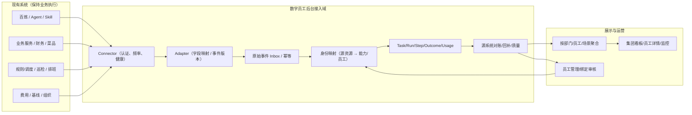

# 15｜数字员工数据接入：数据源、连接器、事件契约与对账（讨论稿）

> **讨论稿，不代表源系统已经允许接入或数据可用。** 本方案服务首期“集团管理层优先”以及 [14 数字员工管理](14-employee-management.md)。已确认前端 Vue 3/TS/Vite、原型 1:1；以下接口、源系统与服务端设计均是建议，尚待具体系统 Owner、IAM/安全、财务审批。
>
> 源系统调研使用 [16 五场景接入盘点表](16-source-inventory.md)；目前没有生产权限与采样验证。
>
> 原型的模拟 `pushFeed` 每 6 秒产生记录和随机成本，月度趋势存在由累计数计算出的演示分布；因此**页面有数据 ≠ 数据接入完成**。正式模式必须凭借可核对的源业务任务/回执/费用证据生成指标。

## 1. 先明确接什么：五类数据而非单一 Agent 调用日志

| 数据域 | 核心内容 | 主要来源（候选） | 对管理层的作用 | 首期优先 |
| --- | --- | --- | --- | --- |
| **资产与组织** | 员工编码、Owner、业务部门、能力、外部 Agent/Workflow 绑定、生命周期 | 数字员工管理后台 + IAM/HR 组织数据 | 上线人数、业务覆盖、责任归属 | **P0** |
| **业务任务事实** | 唯一 Task、任务类型、起止、状态、最终业务回执 | 业务系统/任务平台/审批系统/批处理系统 | 完成业务任务数、业务成功率 | **P0** |
| **技术执行** | Run、Step、工具调用、trace、错误、Token 使用量 | Agent 平台、工作流引擎、自建服务/调度器 | 故障追踪、自动化程度、成本归因 | **P0 最小链路；扩展 P1** |
| **成本与人工基线** | Usage/费用账单、人工耗时抽样、复核成本、分摊规则 | Agent 计费、业务财务/人工测量 | 工时释放、总运行成本、单位成本 | **P0 定义和占位，完整核验分期** |
| **运行健康与审计** | 源系统心跳/采集水位、异常/SLA、登录和变更审计 | 接入网关、业务系统、现有监控/工单 | 数据可信度和业务风险 | **P0 最小** |

没有经源系统核对的 BusinessOutcome 只能说“技术执行完毕”，不能称“业务任务成功”。

## 2. 接入对象层级：连接器、资源绑定、归属规则相互分离



- **Connector** 代表一个外部系统的接入配置（例如某个工作流平台生产环境），可服务多个 Employee。
- **ExternalResource** 代表该系统中的 Agent/Workflow/Job/API 资源，一个资源可绑定多个 Employee/Capability。
- **Binding** 定义 Employee 的业务能力与外部资源的关联，包含生效时间、用途、环境、归属匹配规则。
- **Adapter** 将源数据映射成统一 Task/Run/Step/Outcome/Usage 事件；**不是凭资源 ID 自动判业务归属**。
- **任务归属唯一**：需要业务标识或明确路由规则把一次工作落到唯一 `employee_id / capability_id`；无法归属的数据进入待确认队列，不能多方重复求和。
- 同一任务存在多个来源（Agent 记录执行；菜品服务记录生效）时，需用可控映射键关联；以**源业务系统的最终结果**作为成功真值，不要各自生成一条独立 Task。

## 3. 四种接入模式及建议选择

| 模式 | 适用系统 | 优点 | 风险/保障 | 建议 |
| --- | --- | --- | --- | --- |
| **A HTTP 签名事件/Webhook** | 可改造的 Agent Gateway、业务服务 | 易携带业务 ID、事件状态、结果回执 | 防伪、防重放、幂等、补发、断网容错 | **优先** |
| **B 已有 Kafka/业务事件适配** | 现有业务总线和业务系统 | 与生产主链路解耦、适合批量 | 消费位点、乱序、幂等、主题权限 | **有现成事件时优先复用** |
| **C 只读增量拉取** | 不支持事件推送的旧系统 | 不需要修改源代码，便于快速接入 | API 限流、分页/游标、数据延迟、删改回补 | **可接受，但标注更新时效** |
| D DB 直查/CDC | 无 API、已批准的数据同步链路 | 能获取完整事实 | 变更耦合、合规/权限、源库压力 | **最后选择；禁止直接给前端生产数据库权限** |

不必全公司只能选择一种模式；一个 Connector 可以同时消费“Agent 技术执行”和“业务最终结果”两个来源。

**看板故障时不得阻断原业务处理**。业务侧上报应异步、可补发、有重试队列；接入服务 ACK 的含义是“事件已可靠接收或持久化”，不是业务操作成功。

## 4. 五个场景如何接入（候选矩阵，需源 Owner 调研）

| 场景 | 推荐 Task 粒度 | Agent/技术事件来自 | **业务结果以谁为准** | 必需关联键 | 特色指标与风险 |
| --- | --- | --- | --- | --- | --- |
| 智能报销 | 一次业务提单委托（若拆单需父子计量） | Agent/解析/钉钉入口/业务服务日志 | 费控平台**已受理提单**；财务审核和实际付款是不同阶段 | 原始提单请求 ID → 费控单据 ID | 人工确认时长、解析成功、反复匹配；不能把“单据解析完”算业务成功 |
| 菜品调整 | 一次经确认的业务变更申请 | 钉钉/Agent/菜品 API 的调用链 | 菜品服务**已写入并按业务规则生效/分发** | 变更申请 ID → 菜品业务回执 ID | 生效范围、审批等待、版本回执；不能把 HTTP 200 直接当最终业务成功 |
| 采购情报 | 一次查询或一份报告（需拆 task_type） | Agent+Skill/采集任务 | 报告已交付目标渠道/业务确认可用 | 查询/报告请求 ID、交付凭证 | 时效性、来源质量、人工抽检；查询与报告不可混作同质工作量 |
| 门店巡检 | 门店 × 巡检周期 × 任务计划 | 巡检/监控平台任务 | 巡检计划**已完成采集和校验**；整改是另一工单生命周期 | 巡检计划 ID、门店引用、周期 | 应检/实检覆盖；高频传感器读数不作为 Task 全量上报 |
| 稽查排班 | 一份排班周期工作单 | 规则求解服务/定时任务 | 负责人复核并**发布排班表** | 排班批次 ID、发布版本 | 约束冲突、复核等待、发布回执；“算法产出候选表”不是业务终态 |

以上是**建议的接入点**，没有独立验证任何一个生产系统当前具备哪些 API/日志或业务 ID。尤其是财务审核或菜品高影响审批规则，不应因为原型写“已定稿”就视为正式可用。

### 调研一份必填的 Source Mapping 表

- 源系统名称/环境/技术负责人/业务负责人；
- 当前是否支持 webhook/Kafka/定时增量接口；
- `source_task_id`、`external_run_id`、`business_receipt_id` 分别怎样获取；
- 最终状态与业务成功定义，是否存在撤销、冲正或回补；
- 事件发生时间/时区/营业日、任务创建时刻、完成时刻；
- 使用量/计费凭证来源，人工基线样本有没有审批；
- 可用样本数、延迟、每日日均量、补发策略、数据权限；
- 可能涉及的敏感字段与脱敏方案；
- 是否已有对账报表/API 可用于每日源端比对。

**不具备这些信息时，不应先写“所有员工统一成功率 98%”的接口逻辑。**

## 5. 建议的标准事件封套（示意虚构数据）

```json
{
  "schema_version": "1.0",
  "source_system": "dish-service-demo",
  "source_event_id": "event-001",
  "event_type": "TASK_OUTCOME_CONFIRMED",
  "occurred_at": "2026-10-10T09:00:00+08:00",
  "source_task_id": "change-request-demo-01",
  "source_run_id": "run-demo-01",
  "employee_id": "employee-dish-demo",
  "capability_id": "capability-price-update",
  "tenant_id": "group-demo",
  "business_department_id": "operations-demo",
  "task_type": "DISH_PRICE_CHANGE",
  "business_outcome": {
    "status": "SUCCEEDED",
    "result_ref": "dish-receipt-demo-01",
    "confirmed_by": "dish-service-demo"
  },
  "trace_id": "00000000000000000000000000000001",
  "data_classification": "NON_SENSITIVE_DEMO"
}
```

注意：
- `employee_id` 可由可信的生产者声明，但**接入服务仍应按 Connector 身份、配置与绑定关系验证其是否有权替该员工上报**；不信任任意事件体传入的 employee/department。
- 外部系统若无法拿到 `employee_id`，可使用 `source_system + external_resource_id + source_task_id` 配合经审核的绑定解析；**不能靠中文名称推断**。
- `source_event_id` 必须重试稳定；原始事件幂等键建议为 `tenant_id + source_system + source_event_id`；跨多个源系统同一业务任务的身份合并要用明确关联表，不是按 taskId 字符串碰巧相同。
- 收到最终结果还需源业务系统可信签名/回执引用与**合法状态转换**；技端 `RUN_FINISHED` 不能自动生成 `TASK_OUTCOME_CONFIRMED`。
- `occurred_at` 与平台 `received_at` 必须区分，接入系统打上接收时间并记录延迟；原始事件和字段映射版本保留可审计。
- 原型数值与例子均不构成生产业务 ID、实际数据源存在、真实审批规则已确认的证据。

## 6. 有状态同步与去重：推荐处理流程

```text
接入系统鉴权（Connector 客户端凭证/签名）
  → 入站字段合法性与敏感字段检查
  → event inbox（持久化、tenant+source+event_id 幂等）
  → Schema 校验与 Connector Mapping 版本化转换
  → external_resource / task_type / employee 唯一归属校验
  → 生成或更新唯一 Task、对应 Run/Step/Intervention/Outcome/Usage
  → 重算受影响员工/部门/场景/日期聚合
  → 记录 watermarks / 采集时效 / 完整性
  → T+1 与源业务系统计数/金额/结果状态对账
  → 异常进入接入健康面板，必要时重放或冲正
```

**异常处理机制**：
1. 重复事件 → 幂等跳过，不重复计成本与任务。
2. 合法晚到事件 → 回补/重算对应统计周期，保留前后版本。
3. 不认识的员工/资源 → 隔离“未匹配任务”，等待人工映射，不能静默丢弃。
4. 事件类型或 Schema 版本未知 → 拒绝或隔离，记录原因和采样，源端收到可重试/修正反馈。
5. 接入错误 → Connector 状态 ERROR；服务持续未上报超过预期频率 → STALE，不以“0 条失败”当正常。
6. 技术成功但业务回执缺失 → `PENDING_OUTCOME`，不算成功，也不应默认算失败。
7. 业务结果被撤销/更正 → 源系统更正事件，重算相应聚合并留下变更说明；不得物理覆盖原事实。
8. 没有已核验成本/工时基线 → KPI `quality=UNAVAILABLE` 或 ESTIMATED，视事实而定，**不能假定节省等于调用耗时差**。

## 7. Connector 管理页（管理员功能，建议 UI-F1）

**位置建议**：从员工详情的“管理/数据接入”按钮进入，经 IAM 后端授权；不新增管理层首页的一级 tab，以保护 UI-F0 原型。

### 7.1 连接器列表

列字段：系统名/类型、环境（DEV/UAT/PROD）、已绑定员工和资源数、模式（Webhook/Kafka/Pull）、最近接收、最近成功同步、最后源端对账、延迟与错误、负责人。

状态按 `NOT_CONFIGURED / TESTING / HEALTHY / STALE / ERROR / DISABLED` 独立维护；Connector HEALTHY **不等于下游业务任务验真完成**。

### 7.2 新建或编辑连接器分步向导

1. 选择**来源系统类型**与接入模式；
2. 配置连接身份：凭证通过 Secret Manager/企业密钥服务引用，**不回显密钥，也不入 GitHub/前端包**；
3. 选择要绑定的外部资源（Agent ID、Workflow ID、定时任务、业务服务）和目标员工能力；
4. 字段映射：Task ID、Run ID、业务状态、回执、费用、时间/时区、敏感字段规则；
5. 运行只读连接测试/演示事件测试，核验身份、事件签名、去重和实际字段；
6. 样本与结果人工审阅，通过后启用生产接入，记录负责人/映射版本。

**连接成功 ≠ 业务口径通过**。测试应明确分开“可连接”“能找到执行记录”“有合法业务回执”“能对账”“已核验工时成本”。

### 7.3 接入健康详情

- 已接入员工数、已绑定源资源数、最近事件时间、Watermark、当日接收/去重/隔离数量；
- 数据延迟 P50/P95（可选）、预计/实际源业务任务数与差异；
- 未匹配员工或 Task、丢回执、Schema 错误及安全拒绝的采样；
- 允许有权限的管理员**补发/重放数据入站处理**；MVP 不提供“重新执行源业务任务”的按钮。

## 8. 数据库与 API 的扩展建议

### 8.1 基础表

| 表 | 定义 | 关键键 |
| --- | --- | --- |
| `dw_connector` | 数据源连接器及接入方式、负责人、环境、健康状态 | `connector_id`，外部系统与环境唯一标识 |
| `dw_connector_mapping` | 字段映射/Schema/转换规则的版本历史 | `connector_id, mapping_version` 唯一 |
| `dw_external_resource` | Agent/Workflow/Job/API 资源目录 | `tenant_id, source_system, environment, resource_type, resource_id` |
| `dw_resource_binding` | 员工能力与资源绑定及生效期 | `capability_id, resource_id, active_from/to` |
| `dw_identity_link` | 跨源 Task / 业务回执引用关系 | 源 ID、目标规范 Task ID、映射类型与版本 |
| `dw_event_inbox` | 原始事件幂等账本（见 [04](04-metrics-and-contracts.md)） | `tenant_id, source_system, source_event_id` |
| `dw_ingest_checkpoint` | 增量拉取游标、Watermark、健康与回补位置 | `connector_id, stream_type` |
| `dw_reconcile_batch` | 每源系统/日期/业务类型对账及差异 | `connector_id, business_date, task_type` |
| `dw_unmatched_event` | 身份/任务归属缺失与冲突事件的待处理记录 | 入站事件 ID、隔离原因、处理状态 |
| `dw_usage` | 费用账本、费用单元及核验状态 | `usage_id` 去重，账单版本/币种 |

数据仓库模型要区分事实明细（可回放）与聚合快照（可重算）；高频巡检原始设备时序不复制进数字员工账本。

### 8.2 API 轮廓（建议，不是已实现）

```http
GET    /api/v1/connectors                       # 管理/审计视图，分页
POST   /api/v1/connectors                       # 创建连接器（凭证仅安全引用）
PATCH  /api/v1/connectors/{id}                  # 变更频率/字段映射/负责人
POST   /api/v1/connectors/{id}/test             # 有权限的只读连接测试
POST   /api/v1/connectors/{id}/activate         # 启用数据采集（需审查）
GET    /api/v1/connectors/{id}/health           # 水位、漏数、隔离与最近对账
GET    /api/v1/connectors/{id}/mappings          # 映射版本与脱敏规则
GET    /api/v1/unmatched-events                 # 待归属事件
POST   /api/v1/unmatched-events/{id}/resolve    # 映射修复+合法状态重放
GET    /api/v1/reconciliations                  # 源数据计数/金额对账
POST   /api/v1/ingest/events                   # 系统入站认证/签名幂等
GET    /api/v1/overview                        # 集团/部门聚合快照 + 数据质量
GET    /api/v1/employees/{id}/tasks            # 溯源业务任务
```

建议结构为 Spring Boot 模块化服务 `catalog/connector/ingest/execution/metrics/governance`；接入网关与定时拉取、指标聚合可由后台任务处理，具体技术栈仍待评审。

## 9. 首期闭环试点：两个场景不同类型的源数据

### 9.1 菜品调整（业务写入型）

- **输入**：钉钉/工作流发起变更，请求产生唯一 source_task_id；
- **执行**：Agent 解析参数、校验、审批→菜品业务接口；
- **真值**：菜品服务写入且所要求的版本生效/回执完成；
- **产物**：关联 Task、至少一个 Run、业务结果证据、可能的审批；
- **验收**：Agent 回答成功但源系统失败时，集团任务成功数**不能增加**；重试多次仍只记一条 Task。

### 9.2 智能报销（单据+人工协作型）

- **输入**：账单/提单请求唯一 ID；
- **执行**：解析/校验/员工确认或豁免/向费控提单；
- **真值**：费控系统正式受理提单，真实审核/付款是**独立阶段**；
- **产物**：任务流程状态、人审次数/等待耗时、源端受理号；
- **验收**：等待确认不计成功；提单成功才记目标阶段成功；同业务拆单需预先选择父或子计量单位，不能叠加。

这两个场景是**建议**，还未获得源系统 API 权限、样本与业务 Owner 签认。

## 10. 接入验收 Checklist

- [ ] 数据源和资产连接有唯一稳定 ID、环境与租户边界；
- [ ] Connector 对源资源的绑定经过管理员审核，不能伪造员工 ID；
- [ ] 一条业务委托多次模型/Run 调用，平台业务任务总量只增加 1；
- [ ] Agent 提示“成功”但源业务确认失败时，集团 KPI 正确记失败/等待；
- [ ] 重复事件和补发不重复计数、重复计费；迟到/更正可以冲正重算；
- [ ] 任务关联不到员工时进入隔离队列，不被错误算进所有绑定员工；
- [ ] 原系统无数据、未集成、迟滞、真实 0 是不同 UI 状态；
- [ ] 员工从某业务部门转到另一部门，历史聚合有固定策略与审计；
- [ ] 管理层可追溯 KPI 计算依据，但不暴露敏感合同、账单、原始 Prompt、人员隐私；
- [ ] 财务工时基线未经审定时即使 Task 成功，也不能声称经济收益已核验；
- [ ] 接入中断、越权、Schema 错误和源结果冲突均有告警和处理人；
- [ ] 接入平台故障不阻断原始业务处理，支持缓冲与重放。

## 11. 待项目发起人和源系统负责人确认的关键选择

| ID | 决策 | 推荐 | 状态 |
| --- | --- | --- | --- |
| I1 | 平台是否只统计 Agent 调用数据？ | **不够；需源业务任务回执为最终结果真值** | 待确认 |
| I2 | 连接器以什么方式接入？ | **允许混用 Webhook/Kafka/只读 Pull**，按源系统能力定 | 待确认 |
| I3 | 接入对象是“一个 Agent 绑定一个员工”吗？ | **不是；Employee→Capability↔ExternalResource 多对多，任务归属唯一** | 待确认 |
| I4 | 接入管理界面是否首期提供？ | **P0 最小：连接器登记、绑定、测试、健康、映射与错误** | 待确认 |
| I5 | 哪个系统能够提供业务成功凭据？ | 优先调研菜品服务、费控服务，缺源真值不得标已核验成功 | 待确认 |
| I6 | 费用/工时从哪里来？ | Token 使用事件+账单/分摊+业务 Owner 人工样本+财务核准 | 待确认 |
| I7 | 对未知员工/错误 Task 的处理方式？ | 隔离/待匹配，不丢弃也不盲目计入 | 待确认 |
| I8 | 员工、连接器与源配置是否可控制业务执行？ | 首期**只管理资产/观测与接入**，不直接停止业务或发起危险重试 | 待确认 |
