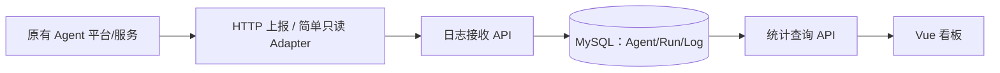

# 17｜MVP 范围冻结：Agent 登记、执行日志采集、看板展示

> **已确认的产品范围（2026-10-10，项目发起人在会话中明确收缩）**：**不做复杂数字员工管理和业务结果对账；只做 Agent 登记 → 采集 Agent 日志 → 展示看板**。
>
> **此前仍然有效的已确认决定**：集团管理层优先；原始 [HTML](../prototype/index.html) 保持不变并作为 UI-F0 的布局基准；正式前端使用 **Vue 3 + TypeScript + Vite**。
>
> **本文件是 MVP 最高优先级的范围说明**。此前 [02](02-product-prd.md)、[03](03-architecture.md)、[04](04-metrics-and-contracts.md)、[05](05-roadmap-and-decisions.md)、[06](06-management-dashboard.md)、[07](07-executive-data-architecture.md)、[09](09-frontend-data-implementation.md)、[11](11-frontend-backlog.md)、[14](14-employee-management.md)、[15](15-data-integration.md)、[16](16-source-inventory.md) 中涉及“业务 Task/Outcome、双 Owner 审批、复杂 Connector、工时基线、财务对账”等要求已**退出本期 MVP**；仅作远期设计参考，不能作为首期开发/验收条件。
>
> 本文件中的具体日志字段、API 命名、数据库表和技术实现属于**建议落地细节**，不是用户逐项签署的技术决策；真正的源 Agent 平台接口可用性仍需接入前验证。

## 1. 只做三件事

| 功能 | 用户操作 | 首期最小能力 |
| --- | --- | --- |
| **Agent 登记** | 新增、编辑、停用、查看 Agent | 名称、平台、原平台 Agent ID、所属部门、负责人、说明、启用状态 |
| **Agent 日志采集** | 给已登记 Agent 配置日志上报或适配 | 每次 Run 的开始/结束/状态/耗时；可选分级日志、Token、错误信息；幂等、脱敏、最近采集时间 |
| **运营看板** | 查看集团整体、按部门分组、进入单 Agent 详情/监控 | Agent 数、执行次数、执行成功率、平均耗时、趋势、最近执行、失败记录；来源/时间/数据缺失提示 |

**首期没有**：能力/多资源绑定体系、审批上线流程、Agent 编排、工作流编辑、源业务回执联通、Task/Run/Step 复杂业务账本、业务成功/财务价值核验、工时节省/ROI、对账平台、复杂 Connector 向导、自动发现、告警工单操作、成本分摊。保留日志只读查看；原型的“告警处理/忽略”在 UI-F0 仍是演示交互，UI-F1 **不接任何真实写操作**。

**简单定义**：**一条登记记录对应一个外部 Agent 实例**（例如一个百炼 Agent ID），并在本平台显示为一名数字员工。不同环境（测试/生产）用不同登记项或明确标识。一个 Agent 可以有多次 Run。此为按本轮用户范围作出的最简实施解释；将来若需要一个数字员工整合多个 Agent，再单独讨论。

## 2. UI 设计：原型 1:1 外观，正式数据口径简化

### UI-F0：不改原型的布局和演示效果

- [原始 HTML](../prototype/index.html) 原样保留；Vue 四页（总览、员工详情、五场景静态展示、监控）按原型布局和样式复刻。
- Demo Provider 的 9 张卡、5 场景、每 6 秒模拟动态、原型图表仅出现在**明确标注 DEMO** 的独立演示环境。
- 五场景页暂时作为**静态展示**；不建立业务流程/审批的配置后台，不把原型“真实在用”当生产状态。

### UI-F1：替换真实 Agent 数据，但保持同一个页面结构

| 原型显示 | MVP 正式页面如何表达（建议） |
| --- | --- |
| 数字员工总数 | **登记 Agent 数** |
| 今日执行任务 | **今日 Agent Run 数**（不是业务任务数） |
| 当日成本 | **平均执行耗时**或今日失败 Run 数；成本无真实计费数据时不显示假值 |
| 自动化成功率 | **Agent Run 成功率**；只代表技术执行状态 |
| 员工卡（真实在用/运行中） | 名称/部门/负责人/平台；登记启用状态 + 最近日志时间分开显示 |
| 节省工时趋势 | **Agent 执行量趋势**，不显示“节省工时” |
| 成本趋势 | **Run 耗时趋势或失败率趋势**；若可信 Token/计费数据后来可用再增加成本 |
| 场景效能排行 | **Agent 执行量排行**（标明按 Run 次数，不代表业务贡献） |
| 员工详情 | Agent 基本资料、执行数/成功率/平均耗时/最后活跃、执行历史及错误 |
| 监控中心 | 最近 Run、失败日志、接入延迟；原型告警处理仍仅 Demo，不做生产处置 |

原型**布局、卡片数量、图表位置、色彩不变**，但正式模式的**文案/数据与图表含义必须反映真实日志能力**。这是“保持原型视觉，不沿用虚假业务效能指标”。

**无数据**：未接入日志的 Agent 显示“无日志/未接入”；已接入但近期无新记录显示“最近活跃时间/数据可能延迟”；真实 Run 数确为 0 显示 0。登记启用状态 ≠ 运行在线，不能通过无日志直接宣称离线。

## 3. Agent 登记字段（推荐最小字段）

| 字段 | 示例/约束 | 说明 |
| --- | --- | --- |
| `id` | 系统生成 UUID/雪花 ID | 本平台内部主键 |
| `name` | 菜品调整助手 | 显示名称，不用作唯一键 |
| `platform` | BAILIAN / CUSTOM / OTHER | 所属 Agent 运行平台 |
| `external_agent_id` | 源系统稳定标识 | 与平台、环境组成唯一性约束 |
| `environment` | PROD / TEST | 禁止测试日志混入生产报表 |
| `department_id` | 可读部门编码 | 首期可先从企业组织列表选择，尚无 IAM 时使用登记字段 |
| `owner` | 责任岗位或人员引用 | 方便发生错误时找到人 |
| `description` | 用途简介（可选） | 供管理层阅读 |
| `enabled` | true / false | 登记表内是否启用接入，不直接停止远端 Agent |
| `created_at/updated_at` | 服务端时间 | 基本维护审计 |

**不设计**独立的 Capability、资源多对多 Binding、人工上线审批准入、成本与工时基线、自动资产发现。首期“停用”只影响采集和展示状态，不调用外部 Agent 平台停机。

## 4. 日志采集：只需一条简单链路



**首选方式建议**：Agent 运行完成时由调用方通过 **HTTP POST** 上报一条 Run 摘要；需要查看步骤错误时，可额外上报简短分级日志。已有平台没有主动上报能力时，**再做一个只读拉取适配器**，不用首期开发通用 Connector 管理框架。

### 最小 Run 记录示例（虚构的 DEMO 数据）

```json
{
  "platform": "BAILIAN",
  "external_agent_id": "agent-demo-001",
  "environment": "PROD",
  "run_id": "run-demo-1001",
  "status": "SUCCEEDED",
  "started_at": "2026-10-10T08:10:00+08:00",
  "finished_at": "2026-10-10T08:10:05+08:00",
  "duration_ms": 5000,
  "input_tokens": 680,
  "output_tokens": 180,
  "error_code": null,
  "error_message": null
}
```

其中 `input_tokens/output_tokens`、`duration_ms`、`error_code` 可以由实际平台能力决定是否可选。若源平台只给 Run 终态/耗时而不提供逐条日志，首页仍可统计执行情况；详情页只展示实际有的字段，不虚构 Step。

**推荐状态**：`RUNNING, SUCCEEDED, FAILED, CANCELLED, UNKNOWN`。成功率的分母仅包含观察窗内 **SUCCEEDED + FAILED** 的终态 Run；取消/运行中单独统计（是否把取消计入分母可在后续细化）。平均耗时只统计有真实 duration 的已结束 Run；空集合返回 `null`，不返回伪造 0。

**推荐时间口径**：
- 今日执行量 = 统计时区内 `started_at` 落在今日的唯一 Run 数，标题写清“启动次数”；若平台仅提供结束记录，则须决定统一以 `finished_at` 统计，不得混口径。
- 成功率 = `SUCCEEDED / (SUCCEEDED + FAILED)`，依据 `finished_at` 时间窗统计；重试会形成多个不同的 Run，**就是多次 Agent 执行**，不属于业务任务去重。
- 最近活跃 = 最大有效 `finished_at/started_at`，只代表**最后可观测活动**。
- 延迟 = 服务接收时间 `received_at` 与源发生时间之差；需要防止极端时间偏移影响排序。

**最少也要保留**：`agent_id`, `run_id`, `status`, `started_at` 或 `finished_at` 中可信的一项，`received_at`, `source_platform`。同一 Agent + 源 Run ID 的多次上报只存一个运行记录，必要时允许合法状态更新；不同 Agent 的 Run ID 即使相同也不合并。

### 数据安全与稳定性（避免过度工程化）

- 接收 API 必须认证发送方，并校验发送方可上报哪个 Agent；密钥放服务端 Secret/配置，不能写仓库/前端包。
- **默认不采集用户原文 Prompt、模型原始回复、上传文件、账单、手机号、员工敏感信息和完整工具请求/响应**。仅收必要摘要、脱敏错误和可选 usage；禁止将 PII 原文写入公共日志。
- 接口参数大小限制、分页、基础速率限制及幂等键必需；连接失败可稍后补发，不能阻断 Agent 原本工作。
- **复杂 Kafka/Flink、CDC、全公司 Connector 管理系统、全量 Trace 搜索**均不在 MVP 范围。

## 5. 最小持久化表（建议三张）

| 表 | 字段概要 | 重要约束 |
| --- | --- | --- |
| `dw_agent` | ID、平台、外部 Agent ID、环境、名称、部门、负责人、描述、enabled、维护时间 | `(platform, environment, external_agent_id)` 唯一（需将源命名空间纳入防碰撞） |
| `dw_agent_run` | ID、Agent ID、source_run_id、状态、开始/结束/接收时间、耗时、usage、错误码/摘要 | `(agent_id, source_run_id)` 唯一；状态变更幂等且不可倒退 |
| `dw_agent_log` | Agent ID、Run ID、级别、时间、脱敏消息/错误、源日志 ID（若有） | 按 Agent/Run/时间分页；有源 log ID 则幂等去重 |

如源平台只能提供 Run 摘要且没有安全的明细日志接口，**首期两张表足够**，第三张 `dw_agent_log` 按实际需求再上。尽量通过 SQL `GROUP BY` 与索引完成初期看板查询；数据量变大后再引入按日聚合表。

## 6. 最小 API（建议）

```http
GET    /api/v1/agents                      # 列表、部门/名称/平台/状态筛选
POST   /api/v1/agents                      # 登记 Agent
PATCH  /api/v1/agents/{id}                 # 编辑/启停
GET    /api/v1/agents/{id}                 # 基础资料 + 最近采集状态

POST   /api/v1/ingest/agent-runs           # 服务间认证，上报单条或小批次 Run
POST   /api/v1/ingest/agent-logs           # 可选，短日志/错误明细
GET    /api/v1/agents/{id}/runs            # 分页查看执行记录
GET    /api/v1/agents/{id}/logs            # 可选，分页查看脱敏日志

GET    /api/v1/dashboard/overview          # 注册数/Run 次数/技术成功率/平均耗时
GET    /api/v1/dashboard/trends            # 每日 Run 次数、耗时、失败数
GET    /api/v1/dashboard/rankings          # 按 Agent 执行量/失败率（注明分母）
```

正式环境的**查询授权**仍需满足集团权限规范；首期可使用现成 IAM/统一登录，而不是造完整新的用户/角色管理系统。

## 7. 极简开发里程碑（建议）

| 迭代 | 交付物 | 可客观验收的条件 |
| --- | --- | --- |
| A 原型 UI-F0 | Vue 原型复刻 + Demo Provider | 保留原始布局，4 页交互、9 示例卡、5 静态场景、图表和移动适配 |
| B Agent 登记 | 简单管理列表/表单 + CRUD API + MySQL | 新增、编辑、停用一个 Agent，并在正式看板显示 |
| C Agent 日志 | 上报 Run API（+ 可选分级错误日志）、分页查询 | 提交成功/失败 Run、重试同一源 Run ID 不重复计算 |
| D 实际看板 | API Provider + 技术执行 KPI、趋势、排行、详情 | 总览与单 Agent 日志数能对齐；断流显示最后采集时间，不显示原型数字 |

**不需要前置完成菜品、报销等业务源系统回执整合**。可先接一套有真实 Run ID、状态和时间戳的 Agent 日志链路，验证全部页面的核心闭环。

## 8. 仍需要接入时确认的细节（不阻塞本次范围明确）

1. 第一批 Agent 在哪个平台运行：百炼、Dify、自研 Agent 服务或其他？是否支持 webhook/日志 API？
2. 实际日志是只有 Run 结果，还是有可安全采集的分级错误日志和 Token 使用数据？
3. 各平台的 Run 唯一 ID、时间戳、状态字段如何定义？能否补发/分页读取？

这些是**对接调查问题**，不是重新讨论已经确定的三项功能。默认从 HTTP 运行摘要上报切入，其他集成能力按源平台条件裁剪。

## 9. 对既有研发任务的影响

- **FE-00～FE-08** 仍用于原型 Vue UI-F0 复刻，验收原型视觉与交互（Demo）。
- **FE-09 / Issue #11** 收缩为**正式 Agent 目录/Run 查询 Provider**，只提供 Agent 日志与技术指标，不接业务回执、工时基线或生产告警操作。
- 额外只需要最小 **Agent 登记 API + Run 接入 API + Dashboard 查询 API**，可放在同一个后端服务中。无需创建多套业务子系统。
- [14](14-employee-management.md)、[15](15-data-integration.md)、[16](16-source-inventory.md) 是此前较复杂方案的保留存档，**不是本期必做**。本文件的范围裁决优先于那些旧文档。
