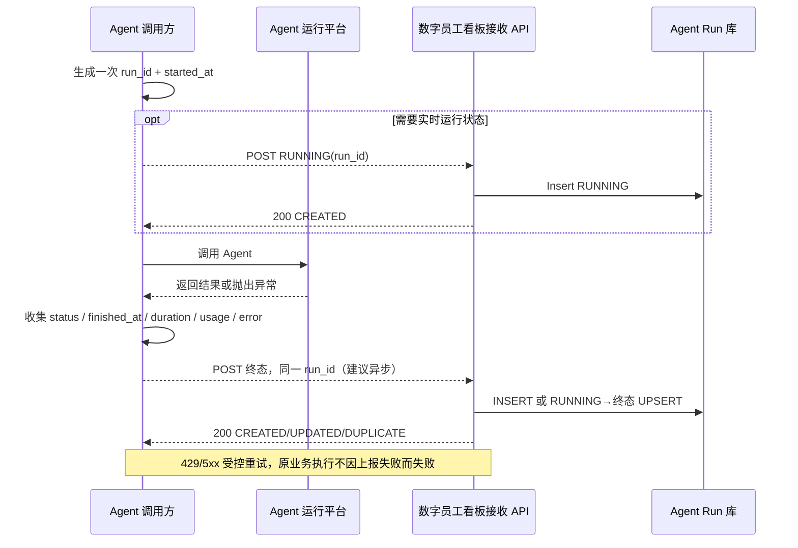

# 18｜Agent Run 上报标准 v1.0（调用侧接入契约）

> **覆盖范围提醒（2026-10-10）**：v1 定义的是**Agent Run 基础执行状态上报**，并**不能完整支撑原型中的成本、工时节省、人工介入、异常恢复与五场景专项指标**。逐页源码核对见 [19 原型全量指标审计](19-prototype-metrics-coverage-audit.md)。**已新增 [v1.1 扩展 OpenAPI 草案](../openapi/agent-run-reporting-v1.1-draft.json) 和 [20 性能扩展迁移方案](20-performance-extensibility-portability.md)**；均为待评审设计，**本文件与 v1.0 OpenAPI 本身不改变**。

> **D13 已确认（2026-10-10）**：在 Agent 调用处增加**简单的标准上报接口**，统一采集执行日志。**本文件提出具体的 v1.0 契约实施标准**，用于开发；具体字段和错误码可在首个真实 Agent 接入时按版本化流程调整。
>
> **机器可读规范**：[OpenAPI 3.1 JSON](../openapi/agent-run-reporting-v1.json)；整体产品范围以 [17 极简 MVP](17-agent-log-dashboard-mvp.md) 为准。
>
> **B03 P0 新增记录要求（2026-10-10，待版本化落地）**：首期一次 Agent Run 需支持保存输入 Token、输出 Token、实际计费模型标识、该次 Token×模型有效单价得到的 ESTIMATED 成本（价格依据可追溯）。**现有 v1.0 只有可选的两类 Token 字段，严格校验不接受新增 `model_id`/`estimated_cost_amount`；本文件所述 v1.0 契约没有因此变更**。必须后续确认向后兼容的新协议/独立模型标识来源、字段必填/空值/币种等，不能要求老 v1 客户端立刻上报新字段。P0 不强制完整多模型调用 Trace 或供应商账单。[详细草案](22-token-pricing-cost-design.md)。
>
> **B03-P0-02 最新确认（2026-10-10，方案 A）**：已有的 `input_tokens/output_tokens` 继续为**可选非负整数**，只能从真实模型 SDK/API Usage 取得；不能因上报缺失而补 0、用字符数估算或拒收合法 Run。真实报告 0 与未报告严格区分；缺少计价所需 Usage 时**费用不可计算**，不得默认 0。供应商字段映射、流式中断/失败取消、迟到更新和质量细节仍未确认，v1 OpenAPI 保持原样。[B03-P0-03 单次成本计算责任方](22-token-pricing-cost-design.md#当前待选b03-p0-03-单次成本计算责任方尚未确认) 原已待选；现在 B03-P0-03 已确认调用方自行计算并上报 ESTIMATED 费用（方案 B），详见最新设计。
>
> 本接口上报**Agent 一次技术执行 Run 的摘要**，不是原文 Prompt/模型响应/所有工具步骤日志，也不是菜品、财务等业务系统的最终回执。

> **B03-P0-03（方案 B）与 B03-P0-04（方案 A）确认，2026-10-10**：调用方负责按模型真实 Usage × **自身维护的有来源、版本化模型单价快照**计算本次模型 ESTIMATED 金额并随 Run 上报；看板端接收/校验/存储，不担任权威重新定价者，不把估算视为已结算账单。价格配置具体字段、维护审批、版本生效时点、币种/精度、缓存/阶梯、缺价/历史更正和单价展示仍待确认。**B03-P0-05 已选方案 B：另立独立版本的简化 Run 上报结构，采用扁平费用金额及价格依据字段，不默认使用 v1.1 草案嵌套 `cost`**；但**实际金额字段/必填/小数位/币种/质量标签、版本编号、严格 v1 兼容分发及重报冲突细则仍未批准**。**B03-P0-06 已选方案 C：费用只做基本字段格式校验，不核验调用方模型费率真实性、Token 覆盖或计价金额偏差，也不能据此认定账单已核验；格式失败后的 ACK/是否影响 Run 尚未批准。** **B03-P0-07 方案 B 已确认：一次 Run 初始缺费可后来补入首笔 ESTIMATED 金额，首次保存后在普通 Run 报文中锁定；重复原金额幂等，不同金额只按冲突处理，绝不能自动覆盖/累加**。补报时限、并发首次写入、乱序、冲突 ACK/错误码、异常修复授权/审计和历史重算尚未确认。**B03-P0-08 已选方案 A：单次 Run 的 ESTIMATED 模型费用按其 `started_at` 所在统计日归属**，跨日执行、迟到首次补入仍属于原启动日；不意味着已经确定历史报表何时刷新/冻结，或状态/环境/币种/质量准入范围。**B03-P0-09 已选 A：集团首页 B03 主卡方向为「今日模型估算费用」，原则聚合有权统计的真实技术 Run ESTIMATED 金额**，不按 Agent 当前 A02 在用标记或暂停/停用自动抹掉历史费用；但 RUNNING/FAILED/CANCELLED、TEST/PROD、归档历史、币种/精度、成本质量准入、缺失/覆盖率等仍待确认。**当前讨论 B03-P0-10 状态和环境过滤**；环境由登记资产与服务授权确定，不可由客户端任意宣称，具体状态/环境/时区/日界和新增 Schema 均未批准。严格 v1 OpenAPI 和未批准 v1.1 草案保持原状。[22 计价讨论](22-token-pricing-cost-design.md)。
>
## 1. 一句话接入方式

在 Agent 的**统一调用包装层**生成一个 `run_id`，执行完成时 `POST /api/v1/ingest/agent-runs` 上报一条终态数据。需要“正在执行”时可提前用**同一个 `run_id`**上报 `RUNNING`。默认只在结束时上报一次即可。



**重要**：一个 `run_id` 表示**一次实际 Agent 调用尝试**。重复发送同一次上报必须重用 ID；如果业务主动再次调用 Agent（重试执行），应生成**新的** `run_id`，技术执行次数就增加 1。平台已有稳定 ID 时直接映射；没有则在调用前生成 UUID，终态/补发沿用同一个。

## 2. URL 与基础规则

| 项 | 标准 |
| --- | --- |
| 方法 | `POST` |
| 路径 | `/api/v1/ingest/agent-runs` |
| Content-Type | `application/json; charset=utf-8` |
| Authorization | `Bearer <INGEST_TOKEN>`，**服务端到服务端**的上报凭证 |
| HTTPS | 正式环境必须使用 TLS |
| 请求体大小 | 推荐服务端最大 **16 KiB**，超限 `413` |
| 版本 | `schema_version: "1.0"`（且路由 `/api/v1`） |
| 速率保护 | 服务端按调用方限流，客户端对 `429` 按 `Retry-After`/退避重试 |
| 服务确认 | 仅**持久化已提交成功**后返回 `200`，不把“收到但尚未写入”当成功 |
| 兼容策略 | v1 不变更必填字段语义；破坏性修改用 `/api/v2` / `schema_version: "2.0"` |

`agent_code` 是看板上登记的**固定识别编码**，而不是可随意填写的中文昵称。登记时保存 `platform/environment/external_agent_id` 等资产资料，并把 `agent_code` 作为调用方上报映射键；**平台及环境由后台配置/授权身份确定，客户端不重复传入**。服务端必须校验 Token 有权向对应 Agent 及环境上报，防止自报其他员工。禁用 Agent 采集后拒绝新的入站记录，不会停止源 Agent 自己的业务执行。

## 3. 请求字段

| JSON 字段 | 类型 | 是否必填 | 说明 / 校验 |
| --- | --- | --- | --- |
| `schema_version` | string | **必填** | 固定 `"1.0"` |
| `agent_code` | string | **必填** | 已登记固定编码；长度 1–64，ASCII 字母数字开头，其余可使用 `._:-` |
| `run_id` | string | **必填** | 同 Agent 下唯一；1–128 字符、同上字符规则；重试保持相同 |
| `status` | enum | **必填** | `RUNNING / SUCCEEDED / FAILED / CANCELLED` |
| `started_at` | RFC3339 | **必填** | 本次执行实际开始时刻，带 `Z` 或 `+08:00` 等时区 |
| `finished_at` | RFC3339 | **终态必填** | 结束时刻，带时区，且不早于 `started_at` |
| `duration_ms` | int >=0 | 可选 | 实际执行耗时；缺失时服务端用起止时间计算，不可得则 null |
| `input_tokens` | int >=0 | 可选 | **实际计量**的输入 Token；不可得则不发送 |
| `output_tokens` | int >=0 | 可选 | 实际计量的输出 Token；不可得则不发送 |
| `error_code` | string | 可选 | 短错误代码 ≤100 字符；失败时建议填 |
| `error_message` | string | 可选 | 已脱敏诊断摘要 ≤500 字符，禁止原文 Prompt/回复/用户信息 |
| `trace_id` | string | 可选 | 已有日志系统的无敏感链路索引，非必需 |

首期请求默认**不提供**任意 `metadata`、`prompt`、`response`、`steps` 和大段日志数组，避免接入越来越复杂或引入敏感信息。后续若要完整调用轨迹，可**另行新增 Trace/Log 查询能力**，与此 Run 级统计接口解耦。

## 4. 请求示例：最小终态 / 含可选字段 / 失败

### 最小终态（一次上报即可）

```bash
curl --fail-with-body -X POST "${DASHBOARD_API_BASE}/api/v1/ingest/agent-runs" \
  -H "Authorization: Bearer ${AGENT_INGEST_TOKEN}" \
  -H "Content-Type: application/json" \
  -d '{
    "schema_version": "1.0",
    "agent_code": "dish-adjuster-demo",
    "run_id": "run-20261010-0001",
    "status": "SUCCEEDED",
    "started_at": "2026-10-10T08:10:00+08:00",
    "finished_at": "2026-10-10T08:10:04+08:00"
  }'
```

文中均为**虚构演示编码和时间**，不可将示例当生产数据。Shell 变量 `DASHBOARD_API_BASE` 和 `AGENT_INGEST_TOKEN` 由调用系统的机密配置提供，不能在 GitHub 或浏览器前端提交真实值。

### 包含 Token 与耗时的成功

```json
{
  "schema_version": "1.0",
  "agent_code": "dish-adjuster-demo",
  "run_id": "run-20261010-0001",
  "status": "SUCCEEDED",
  "started_at": "2026-10-10T08:10:00+08:00",
  "finished_at": "2026-10-10T08:10:04+08:00",
  "duration_ms": 4000,
  "input_tokens": 680,
  "output_tokens": 180,
  "trace_id": "trace-demo-0001"
}
```

### 失败记录

```json
{
  "schema_version": "1.0",
  "agent_code": "dish-adjuster-demo",
  "run_id": "run-20261010-0002",
  "status": "FAILED",
  "started_at": "2026-10-10T08:20:00+08:00",
  "finished_at": "2026-10-10T08:20:02+08:00",
  "duration_ms": 2000,
  "error_code": "AGENT_TIMEOUT",
  "error_message": "Agent execution timed out",
  "trace_id": "trace-demo-0002"
}
```

### 可选开始记录

```json
{
  "schema_version": "1.0",
  "agent_code": "dish-adjuster-demo",
  "run_id": "run-20261010-0001",
  "status": "RUNNING",
  "started_at": "2026-10-10T08:10:00+08:00"
}
```

上报 RUNNING 不需也不应传 `finished_at`；终态再次发送时 `run_id` 与 `started_at` 保持一致。

## 5. 服务端响应

无论新插入、合法状态更新还是完全重复/晚到旧状态，**在合法且可持久化处理完成后统一 HTTP `200`**，响应：

```json
{
  "agent_code": "dish-adjuster-demo",
  "run_id": "run-20261010-0001",
  "result": "CREATED",
  "received_at": "2026-10-10T08:10:04+08:00"
}
```

`result` 值：

| result | 解释 | 统计次数 |
| --- | --- | --- |
| `CREATED` | 首次建立 Run | +1（按 Run 启动时间口径） |
| `UPDATED` | `RUNNING` 合法更新为终态 | 不再新增 Run；按终态调整成功/失败等统计 |
| `DUPLICATE` | 同状态、同不可变事实的重复上报 | 不增加 |
| `IGNORED_STALE` | 终态已存在，收到晚到的旧 RUNNING | 不增加 |

**状态不可倒退**：

```text
（未存在） → RUNNING → SUCCEEDED / FAILED / CANCELLED
（未存在） ─────────→ SUCCEEDED / FAILED / CANCELLED   （仅结束上报）
```

- `SUCCEEDED/FAILED/CANCELLED` 是终态，不接受改为另一个终态；同一 Run 上报冲突的终态返回 `409`，需人工排查源日志问题。
- 同一 Run 的 `started_at`、Agent 身份不可变化；不同值上报视为冲突 `409`。合法的 RUNNING → 终态可以新增 `finished_at`、耗时、Token 和错误。
- 终态在无开始记录时直接创建，随后迟到的 RUNNING 不能覆盖终态。
- 源平台无法给出最终状态、进程异常退出导致终态丢失时，应在看板标记**长时间无更新 / 状态待确认**，不能擅自记为 FAILED。
- 同一次 HTTP 上报超时，即使服务端可能已经提交，调用方仍可使用**原 `run_id`**安全重试；避免为了重试新造 Run ID。

### HTTP 错误与重试

| HTTP | 示例原因 | 客户端动作 |
| --- | --- | --- |
| `400/422` | JSON/字段/时间格式不合法 | 修复输入，不盲目重试 |
| `401/403` | Token 无效或 Agent 无授权 | 检查密钥/绑定；不循环重试 |
| `404` | Agent 尚未登记 | 先登记；避免自动造资产 |
| `409` | 同一 Run 不兼容的终态或元数据冲突 | 记录冲突并排查，不自动改写 Run |
| `413` | 请求超 16 KiB | 精简字段，不能上报完整 Prompt |
| `429` | 限流 | 根据 `Retry-After` 和指数退避重试 |
| `500/503`、网络超时 | 服务异常/未知提交结果 | **使用相同 Agent + run_id** 有界重试 |

**推荐调用端行为**：业务线程完成后将**脱敏的 Run 摘要交给有界异步队列**，发送超时与次数受控（例如初次 + 最多 3 次重试，指数退避加抖动），达到上限仅记录脱敏上报失败警告；**不要重新执行 Agent，也不要让看板上报失败导致原业务返回失败**。需要更高可靠性时再增加持久化待发送队列/Outbox，MVP 不强制。

## 6. 采集器接入点：推荐包在调用方，而不是修改 Agent 本体

- **Java/Spring 应用**：调用 Agent API 的 Service/Gateway 层统一生成 Run ID、采集时间、捕获正常/异常、执行后异步上报。建议抽象 `AgentRunReporter`，由所有调用点复用，不在每个 Controller 手写采集代码。
- **Python/Node**：同理用 wrapper/decorator/middleware 负责 Run 的生命周期和上报。
- **流式/异步 Agent**：必须在流式响应**真正完成**或出错时上报终态，不能在 HTTP 初次返回 stream/任务已受理时直接报成功。
- **Agent 自身内部重试**：若平台只给最终结果，报告一条 Run 即可，说明其粒度是“一次外层 Agent 调用”；不要猜测未暴露的内部调用次数。
- **同一个业务请求再次调用 Agent**：若调用方确实发起第二次独立 Agent 运行，产生新的 Run ID。未来需要关联一组尝试时再加 `correlation_id`，首期不用。
- **同步响应时延**：统计真正的 Agent 调用开始到完成，不把异步日志上报网络耗时算进 `duration_ms`。

伪代码仅示意调用边界，不是仓库里已经可运行的 SDK：

```text
runId = sourceRunIdOrNewUuid()     // 每次真正执行一次；HTTP 上报重试不重新生成
start = clock.now()
try:
    result = invokeAgent(...)
    finish = clock.now()
    reporter.reportAsync(agentCode, runId, SUCCEEDED, start, finish, result.usage?)
    return result
catch (cancelled):
    finish = clock.now()
    reporter.reportAsync(agentCode, runId, CANCELLED, start, finish)
    rethrow
catch (exception):
    finish = clock.now()
    reporter.reportAsync(agentCode, runId, FAILED, start, finish, sanitize(exception))
    rethrow
```

实际情况需保证报告入队本身的异常也**不会改变原业务结果**；finally 清理资源/长连接取消逻辑仍由原应用负责。

## 7. 看板聚合：严格用 Agent Run 而非业务任务

- **登记 Agent 数**：当前被授权可见的 Agent 记录，注册态与最近活跃分开。
- **Run 执行数**：同 Agent 下唯一 `run_id`，在时间窗按 `started_at` 统计。只在终态上报的客户端，长耗时 Run 需等终态入库后才出现在回溯的开始时间段。
- **技术成功率**：按 `finished_at` 查询窗口中 `SUCCEEDED / (SUCCEEDED + FAILED)`，运行中/取消不在分母；分母为 0 返回 null。
- **平均耗时**：已结束且有有效时长的 Run 计算，缺失值不能当作 0。
- **数据新鲜度**：最近成功**接收**的 `received_at`，它不是远端 Agent 的健康心跳；长期无日志仅说明未观察到活动/采集未知。
- **Token**：仅来源有实际值时显示，不能按字符数估算为已核验 Token，更不能由此自动输出未证实财务成本。

## 8. 后端最小表与索引

```sql
-- 片段为字段级约束建议，不是完整迁移 DDL
-- dw_agent: id, agent_code, platform, environment, external_agent_id, enabled, ...
-- UNIQUE(agent_code) 或按明确隔离域 UNIQUE(tenant_id, environment, agent_code)

-- dw_agent_run: id, agent_id, source_run_id, status, started_at,
-- finished_at, duration_ms, input_tokens, output_tokens,
-- error_code, error_message, trace_id, received_at, updated_at
-- UNIQUE(agent_id, source_run_id)
-- INDEX(agent_id, started_at)
-- INDEX(agent_id, finished_at)
```

入站 upsert 必须**在数据库唯一约束和事务内原子化**，不能用“先 SELECT 后 INSERT”在并发下碰运气。Run 终态更新后影响成功率等统计，首期用 MySQL SQL 聚合即可。

## 9. 验收用例（BE-B / FE-09）

- [ ] **仅终态**：登记 Agent 后仅上报一条 SUCCEEDED，执行数+1，成功终态+1。
- [ ] **开始+终态**：RUNNING → FAILED，Run 仍然 1 条，正确记录时长和脱敏错误。
- [ ] **重复发送**：同一终态重试 10 次，只有一条 Run，响应为 DUPLICATE。
- [ ] **乱序**：先收到 SUCCEEDED 再收到 RUNNING，保持 SUCCEEDED，响应 IGNORED_STALE。
- [ ] **终态冲突**：同一 Run 已 FAILED，再上报 SUCCEEDED，返回 409，不更新旧值。
- [ ] **归属验证**：Token A 不能向 Agent B、其他环境上报，返回 403。
- [ ] **未知 Agent**：返回 404，不自动插入假员工。
- [ ] **时区**：等价 `Z` / `+08:00` 时间戳标准化，跨日统计正确。
- [ ] **异常字段**：没有 Token/duration 时空值可保存，不能转为 0；失败消息敏感信息被拒绝或有效脱敏。
- [ ] **字段边界**：运行中报告不带完成时间，终态必须带完成时间；`finished_at < started_at`、负时长、非法状态、请求超 16 KiB 被拒绝。
- [ ] **网络失败**：超时/限流有界重试，原业务结果不受上报失败影响。
- [ ] **生产统计**：Run 技术成功率与明细一致，无真实日志时不采用原型演示数据。

## 10. 版本演进约定

v1 以固定字段和单一 Run 摘要覆盖管理层 MVP。将来确需原文日志、步骤明细、模型计费精度、批量 ingest 或业务 Task 关联时，**先另提需求/升级协议**，不能为了预留扩展在本次 v1 偷建一套通用 Agent 编排与监控系统。
