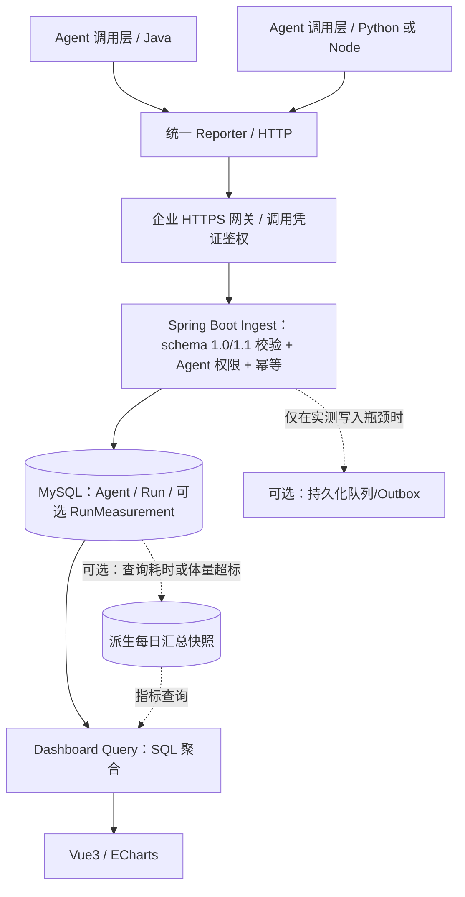

# 20｜MVP 方案深化：性能、可扩展性、可迁移性（设计建议）

> **状态：2026-10-10 建议设计，不等于已经实测、实施或批准。** 产品范围依然只有 **Agent 登记 → Agent 调用处标准上报 → 看板展示**；首期不建设通用 Agent 编排/Connector 平台、业务结果对账、复杂工单或财务核算系统。
>
> 依据：[19 原型全指标审计](19-prototype-metrics-coverage-audit.md)；原始上报 v1.0 [18](18-agent-run-reporting-standard.md)；扩展协议 **[OpenAPI v1.1 草案](../openapi/agent-run-reporting-v1.1-draft.json)**；[17 当前 MVP](17-agent-log-dashboard-mvp.md)。v1.1 是**设计草案**，不能当已上线标准。

## 1. 架构决策：先最小化部署单元，再保持清晰边界



**推荐首期单体部署**：一个 Java/Spring Boot API + MySQL（以及已有企业网关/认证）；内部代码清楚分成四块：`agent-catalog`、`run-ingest`、`run-query`、`metric-policy`。不是四个微服务；这些只是包/模块责任。

### 分层协议

1. **Agent 登记层**：稳定 `agent_code`、平台、环境、版本、部门、Owner、场景等配置，只登记一次，不在每条 Run 重传。
2. **Run 上报层**：一次真实技术执行的事实快照。v1.0 包含身份、状态、耗时、Token；v1.1 草案**可选**操作类型/安全摘要、人工介入、费用与来源、扩展数值。
3. **统计/规则层**：真实 Run 聚合；以已登记的规则/基线做**明确标“估算”**的工时或费用分析。不可从 Run success 直接声称业务完成或实际释放人力。
4. **看板层**：保留原型布局；正式数据展示时间范围、数据截止时间、来源/核验等级。Demo 假数据与生产事实物理或逻辑隔离。

**不建议**：一个大号 JSON 日志里塞 Prompt、所有 tool call、业务单据、Agent 配置与 KPI；这既影响入站吞吐，也破坏脱敏和跨平台迁移。

## 2. 指标覆盖与数据责任：原型逐类落地

| 原型模块 | 核心数据来源 | v1.1 草案字段/规则 | 正式标签或约束 |
| --- | --- | --- | --- |
| 集团/部门已登记 Agent 数 | `dw_agent` | 业务元数据：platform / department / owner / environment / version / enabled | **登记数**不是在线 Agent 数 |
| 当日/累计执行、月度执行趋势、最近活跃 | `dw_agent_run` | `agent_code, run_id, status, started_at, finished_at` | **Agent Run 次数**，重试为新 Run |
| 自动化/执行成功率 | 终态 Run | `SUCCEEDED / (SUCCEEDED + FAILED)` | **技术成功率**；无分母返回 null |
| 最近执行动态、执行流水 | Run | **可选 `summary`、`operation_type`** + 时间/状态/耗时 | summary 必须是脱敏摘要，不是原始 Prompt |
| 人工介入次数/率 | Run | 可选 `manual_intervention_count`，缺失表示**未知** | 介入 Run 比率 = count(明确介入次数>0) / count(明确填报了介入字段且符合窗口条件的终态 Run)。另显示**上报覆盖率**，不能把未知当 0 |
| 单均成本、当日/每月成本 | 有据可查的费用来源 | 可选 `cost.amount/currency/quality/source/basis_id` | BILLED vs ESTIMATED **分列**；不跨币种混求和 |
| 累计/每月节省工时、场景效能排行 | **Agent 或操作类型的基线配置** + 人工实际参与时间（如有） | `operation_type` + `manual_handling_ms` + 人工基线配置版本 | **仅展示“估算工时”**；没有可用基线或必要数据时显示“不可计算”，不得假定 0 |
| 五场景今日执行与最近时间 | Agent↔场景/操作映射 | `operation_type` + Run | “今日巡检/报告数”等是否能以 Run 计必须先定粒度 |
| 五场景专项计量（报告数、巡检数、分子/分母） | 调用方若确实采到 | **可选 `measurements[]`**，必须预登记名称/单位/聚合策略 | 不自动将任务成功推导为业务回执或异常闭环 |
| 异常事件、重试/恢复 | FAILED Run + 可选 `correlation_id` | 失败次数可以直接算；相同 correlation_id 的重试仅能描述**技术重试** | 不把“先失败后成功”直接显示成**告警已处置/业务恢复** |
| 工作流文件、告警处理/忽略 | 非 Run 数据 | 原型 UI-F0 本地预览/演示操作 | 正式 MVP 不提供源业务工单与文件治理 |

### 工时估算必要前提

- `estimated_saved_minutes` **不由 Agent 随意自报为“已验证收益”**。首期如要保留，可在 Agent 配置（或操作类型）里维护 `baseline_minutes`（原人工处理时长）与 `basis_id/version`（依据/核验人），每次有效 Run 只给出估算。
- 推荐仅将**明确适用一次 Run 对应一次人工处理单位**、且完成终态符合规则的执行纳入；否则须先有 `measurements` 的产出数量和业务规则，不能把“巡检 12 项”当“一次巡检”估算。
- `baseline_minutes - observed_manual_handling_minutes` 只是**预估净节省**（人工作业口径），允许负数揭示负效能；若人工处理时长未知，不能静默按 0 算。另需认识技术 SUCCEEDED 不能独立证明最终业务成功，因此默认标签为“潜在/估算节省”，不是经过财务认可的真实收益。
- 标准化保存**规则版本、生效时间、适用操作、结果质量**，防止修改历史基线时让旧月份悄悄改变；首期可以简单一张 baseline 配置表，后续再扩展。

### 成本口径

- `cost.amount` 使用**十进制字符串**，服务端存 `DECIMAL(18,6)` 或与实际费用精度相适配类型；永远不使用二进制 float 计算人民币总额。
- `quality=BILLED` 必须有明确的供应商计费记录依据；未结算的 Token × 计价版本只能是 `ESTIMATED`，要带 `basis_id`；若缺失只显示“未上报成本”。
- 汇总时按照 `currency + quality` 分组；不把 CNY 与 USD 相加；不把“预计费用”和“已出账费用”直接合为“真实成本”。
- 同一次 Run 只统计一次费用；若以后账单回补/更正需要独立费用校正机制，不准悄悄覆盖已核对费用。首期不建财务对账。

### 场景自定义 `measurements`，保持接口轻量

v1.1 草案允许最多 **10** 个 `{code, value, unit, quality, basis_id?}`，例如 `reports_generated=1 REPORT`、`stores_inspected=12 STORE`。这是**可选扩展位**而不是要求所有 Agent 填报。

- `code` 必须在该 Agent 或其操作类型的**受控指标字典中登记**，包括单位、计算模式（求和/次数/比值分子或分母）、是否允许负值、数据来源与敏感等级。
- 首期只需要**计数求和**；覆盖率/闭环率等比值必须有明确 numerator/denominator、同粒度和同时间窗的指标定义。**绝不对各 Run 百分比取简单平均**来计算总体覆盖率。
- 同一 Run 内重复 `code` 判为请求非法，不能重复记；未定义/冲突单位应拒绝该扩展或整单返回字段错误（需在后端契约测试中统一为 422）。
- `SOURCE_REPORTED` 只表示**调用方声明的值**，不是已经被原业务系统独立验证。

## 3. 性能：先用一个轻量写链路

### 3.1 写路径（P0 必要）

```text
POST JSON ≤16KiB
  → 鉴权 / Agent 授权与环境
  → schema_version 严格校验（v1.0/v1.1 分别校验）
  → 脱敏 / 字段长度/安全校验
  → 数据库唯一约束和事务性 INSERT 或有条件 UPDATE
  → commit
  → 200 + CREATED/UPDATED/DUPLICATE/IGNORED_STALE
```

- `UNIQUE(agent_id, source_run_id)` 是不可妥协的幂等基础。同一 Run 的重复 HTTP 投递和数据库并发入站只产生一条事实。
- **200 在提交之后返回**；不要“收到 HTTP 就 200，异步线程还没写入”导致静默丢数。
- `RUNNING → 终态` 可更新；终态同状态的**完全相同事实**返回 DUPLICATE；冲突终态/改变 `started_at` 返回 409。
- **v1.1 可选信息丰富化**：同一 Run 如果已有终态，允许仅对**原先为空的可选字段**做单调补充，返回 UPDATED；已存在字段值不允许静默覆盖，冲突返回 409。特别是已账单费用的更正应交由显式版本化机制，而不是普通重复 POST。上报方最好在首次终态就给齐已知字段，减少额外写入。
- API 不同步调用大模型、业务系统，不生成工时财务报表，不实时更新多张聚合表；入站目标只做有界验证和持久化。
- 大 JSON、原始上下文、图片/PDF、动态无限标签禁止进入采集协议。异常消息在调用侧和服务器双重脱敏。

### 3.2 读路径

| 指标/功能 | 首期实现 | 证明确有瓶颈后 |
| --- | --- | --- |
| Agent 详情最近 50 条 Run | `(agent_id, started_at DESC, id)` 索引 + 基于游标分页 | 冷热数据归档；需要全文搜索才评估检索系统 |
| 当日累计和成功率 | 单库条件聚合，按时间窗和部门授权过滤 | 按日/Agent 的派生聚合表，补偿重算 |
| 月度趋势及 Top 8 | SQL GROUP BY（使用业务时区边界换算后查询） | 预聚合明细，按日汇总至月 |
| 最近实时执行 Feed | 页面可见时 **15–30 秒**轮询，显示数据截至时间 | 确有需求再使用 SSE；不引入高频全量轮询 |
| 仪表盘切换筛选 | 异步取消旧请求、稳定查询参数、服务端分页 | 只缓存**同一授权范围**下的摘要，不缓存敏感明细到公共边缘 |
| 成本/工时聚合 | 能算则按质量与配置版本聚合 | 仅预聚合可重算的派生指标，规则变化可有版本回溯 |

**不建议起步就开启 MySQL 分区表**：MySQL 分区表的唯一索引与分区字段存在约束，可能破坏 `(agent_id, source_run_id)` 唯一性的简洁实现。先建合理索引和归档，之后按实测选择冷热分表/分库，且始终保持全局幂等键处理。

### 3.3 压测/容量设计（以下均为**建议测试档位，不是已测吞吐或 SLO**）

| 情境 | 试验设置 | 主要观察 |
| --- | --- | --- |
| 基础规模 | 10 req/s，混合新 Run/重复/终态更新 | 端到端延迟、DB 锁和写放大 |
| 增长规模 | 100 req/s，叠加一个管理层大屏的查询 | 写接口 P95/P99、慢 SQL、索引命中、DB CPU |
| 峰值/批量补报 | 500 req/s 短时，包含相同 Run 反复重试 | 限流保护、连接池、拒绝比例、队列/客户端重试健康 |
| 数据增长 | 100 万 Run 的**合成数据**（未实际创建） | 7/30/90 天检索、聚合、冷热策略与 DB 空间 |

**建议首期参考目标，须以压测后调整**：在经确认的正常峰值（例如实测可支持的 100 req/s 档）下，写接口 P95 目标 ≤200ms、看板预聚合查询 P95 ≤1s、前端轮询间隔 15–30s；它们**不是现成系统已达到的性能数据**。如果实际负载远小于此，不需要为这些阈值预装队列/OLAP。

### 3.4 数据量与保留

- 容量公式：`每日存储增长 ≈ 每日 Run 数 × (Run 平均字节数 + 索引/行开销) + 测量明细开销`。平均字节数应从真实（已脱敏）数据采样，不能把 1KB 当实测平均。
- 优先保留统计明细查询所需热数据；建议初步评估**90 天 Run 热明细、12 个月聚合**，最终周期由公司数据规范决定，不是已确认策略。
- 时间戳以 UTC 写入、查询时依 `Asia/Shanghai` 或明确筛选时区计算日边界，避免跨日 Run 分类错误。
- Run 过期归档前确认数据处理、历史聚合重算需求和合规删除策略；访问/上报凭证不进入任何数据导出。

## 4. 可扩展性：按瓶颈演进，而不是按技术热度扩容

### 4.1 写压力上升时

**阶段 0**：各 Agent 调用层独立有界异步上报；服务端同步鉴权/落 MySQL 后 200；MySQL 有事务与唯一索引。

**阶段 1**：当多实例/数据库写冲突上升，增加 Ingest 实例、连接池控制和每 Agent/调用方限流。**水平扩容不能依赖进程内的去重 Map**，数据库唯一约束必须仍然生效。

**阶段 2**：仅当上游突发量超出数据库承载或需要更强保留保证时，增加**持久化** Kafka/队列或 Outbox：收到数据先可靠入队后才 ACK（如协议改为 202 必须明确意味着已可靠入队而非已进 Run 表），消费者幂等投影；看板按水位展示延迟。引入此方案时需要重新审查 200/202 语义，不得默默改变现有上报 ACK 保证。

### 4.2 分析规模上升时

- 查询越来越慢：先加索引和**可重算的每日汇总表**，避免额外引擎。
- 员工/Run 数量巨大：先归档/冷热拆分，必要时将聚合复制到 Doris 等分析数据库；OLAP **只是派生查询副本**，源事实和幂等语义不随迁移丢失。
- 需要更多场景自定义 KPI：先登记受控 `metric_code`、单位和计算规则，再让已有 `measurements[]` 可选上报；不允许按任意标签直接作为分组维度，防止高基数标签拖慢报表。
- 需要更完整的 Trace：Run 只留 `trace_id` 与短错误摘要；通过既有追踪系统跳转，不复制每一步的 Prompt/工具负载。
- 成本补账与真实节省工时验证属于**新需求范围**，不作为 KPI 自定义扩展的隐藏实现任务。

### 4.3 数据一致性原则

- **原始 Run 是事实源，日汇总是派生物**；重复/迟到/状态更新可以触发指定日期/Agent 粒度重新汇总，不能无限次简单 `counter++`。
- 单个 Run 如果先报 RUNNING、后报 SUCCEEDED，启动次数仍 1；终态成功数从 0→1；跨日运行分别按 `started_at` 和 `finished_at` 统计，避免负差。
- 告警不能直接等于 FAILED Run 的数量；自动恢复/待处理需要可核对的独立状态，不然正式版只显示“失败运行”。
- 接入完整性缺口是系统自己的监控重点：`ingest_accepted`、`ingest_rejected`、`ingest_duplicate`、`ingest_p95_latency`、每 Agent 最后事件水位、调用方上报队列丢弃/失败次数。看板**无新日志不代表 Agent 离线**。

## 5. 可迁移性：同时考虑 Agent 平台、语言、数据库和环境

| 迁移对象 | 核心做法 | 避免的耦合 |
| --- | --- | --- |
| 百炼 → 自研 / Dify / 其他平台 | Reporter 只依赖标准 HTTP + JSON + agent_code/run_id；各平台在调用层完成 ID、状态、usage 映射 | 生产数据库字段绑死百炼特有枚举和 Prompt 结构 |
| Java → Python / Node / Rust | 用 OpenAPI JSON Schema 作为单一源，提供语言无关示例和合同测试 | 依赖 Spring 专用拦截器/Java 序列化类型作为跨语言协议 |
| MySQL → PostgreSQL | 使用应用层生成的稳定 ID、UTC 时间、DECIMAL、标准化表和受控索引；通过版本化迁移 SQL/Flyway 管理差异 | 把业务定义塞进某种数据库 JSON 方言、存储过程、分区规则 |
| 单机 → K8s 多副本 | Stateless API、凭证在 Secret、连接池限制、健康检查与必要的基础遥测 | 进程内唯一状态/本地文件/只存在 Pod 内存的业务明细 |
| 生产环境迁移 | 平台/环境命名空间和 Agent 编码分开，环境来源由鉴权映射；上报地址配置化，传输 TLS | 客户端写死生产 URL/Token 或把测试数据混生产 |
| OLTP → 分析副本 | Run/Measurement 真值可导出、按时间/Agent 重建聚合；快照有 source/version/watermark | 只保留 Redis 计数器、无可回放事实 |

### 最小可移植数据模型

```text
dw_agent                      -- Agent 登记元数据，新增 agent_code 唯一键
dw_agent_run                  -- Run 事实，一 Agent + source_run_id 唯一
dw_run_measurement (optional) -- v1.1 measurements 的受控指标明细
dw_metric_definition (optional) -- 允许的自定义计量 code/单位/聚合规则
dw_agent_baseline (optional)  -- 经认可的人工基线与版本（仅启用工时估算时）
dw_metric_daily (later)       -- 可重建聚合，不是事实源
```

注意：**首期最少两张表** `dw_agent` / `dw_agent_run` 即可完成 Run 指标。其他表按指标真正启用时增加，避免创建大量空表“为未来预留”。

不依赖数据库 JSON 字段即可实现核心 Run 统计。额外 `measurements[]` 如果要做 SQL 分组与比较，建议规范化存成 `dw_run_measurement`，不要永久只塞 MySQL JSON 并在前端遍历算汇总。

### 契约兼容与版本规则

- **v1.0 原封不动**，原 [OpenAPI v1](../openapi/agent-run-reporting-v1.json) 继续有效。
- **v1.1 仅为草案**，复用同一 `POST /api/v1/ingest/agent-runs` URL，以 `schema_version` 区分 v1.0 或 v1.1 的**严格 JSON Schema**；v1.0 `additionalProperties:false`，直接塞新字段到 v1.0 会收到 422。
- v1.1 **不增加 v1 原有字段的必填要求**；只增加可选 `operation_type, summary, manual_intervention_count, manual_handling_ms, correlation_id, cost, measurements`。
- 服务端先部署可识别两版本的接入实现，完成旧样例回归后，新客户端才能发送 1.1；老客户端不用升级。
- 破坏性字段名或语义变更必须走 v2，不能在 v1.1 悄悄重定义 `run_id`、时间和成功率分母。
- 用**合同回归用例**验证老 v1、v1.1、状态机、幂等、签名/鉴权、币种/数据质量、场景计量、非法高基数字段和并发上报。
- 若跨语言生产者无法自动生成时间戳 RFC3339，必须在各客户端适配层规范化，不通过服务端猜测其时区。

## 6. 最小上线门槛（建议验收表）

| 类别 | 建议验收 | 影响 |
| --- | --- | --- |
| **功能覆盖** | Agent 基础信息、Run 总量/成功率/耗时/月趋势/最近摘要，覆盖真实 Agent 数据 | 与原型的大部分执行类 KPI 对齐 |
| **费用质量** | 成本来源、币种、quality 分组；未提供账单/定价基线时不显示确定金额 | 避免模拟 ¥308 成为经营事实 |
| **人力效能** | 仅在人工基线与参与时长有可信来源时显示估算工时；不准把模型耗时当人工节约 | 避免不可验证绩效 |
| **写入幂等** | 多线程重复同 Run，数据库只留 1 条；乱序/终态冲突不覆盖事实 | 可扩容 |
| **协议演进** | v1.0 客户端继续可投递；1.1 新字段有独立校验；新 Agent 平台可按协议适配 | 可迁移 |
| **请求性能** | 以实测峰值进行混合读写压测；不在无压测时宣称满足 P95 目标 | 可运营 |
| **故障策略** | 看板故障不阻断业务；客户端丢弃/失败计数可观察；如要求零丢失要明示增加持久化缓冲 | 数据可信 |
| **安全** | 凭证仅在服务端、Agent 权限范围校验、摘要脱敏、body 限流和大小约束 | 可安全接入 |
| **看板口径** | 不把失败=告警已处理、不把 Agent success=业务已完成、不把未知成本/人工介入当零 | 可信展示 |

## 7. 需要未来实测/业务确认的部分

1. 第一批 Agent 的**实际峰值 Run/s、日志大小、终态迟到率**和真实保留期限，以决定要不要异步队列、预聚合或归档。
2. 原型中的成本、人工介入与节省工时，分别由谁提供依据；没有基线时应保留原型位置并显示不可用/切换为可测技术指标。
3. 场景专项 `measurements` 的单位、口径与受控指标编码；例如“今日巡检”究竟表示 Run 次数、门店数还是指标条数。
4. 是否要求在技术上**不丢任何一条**上报：仅靠有界内存队列+有限重试不能做到零丢失；要加强就增加调用侧持久化暂存/可靠消息和服务端 durable ACK。

**推荐的建设顺序**：现有 **v1.0 稳定接收** → v1.1 安全摘要/操作类型/人工介入的可选字段 → 在来源具备时启用成本和受控专项指标 → 按实测瓶颈补日聚合/可靠缓冲。**不要一次把全部 P1 扩展做完才上线**。
